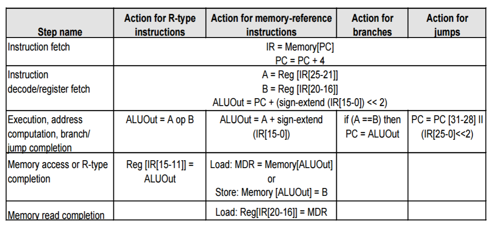
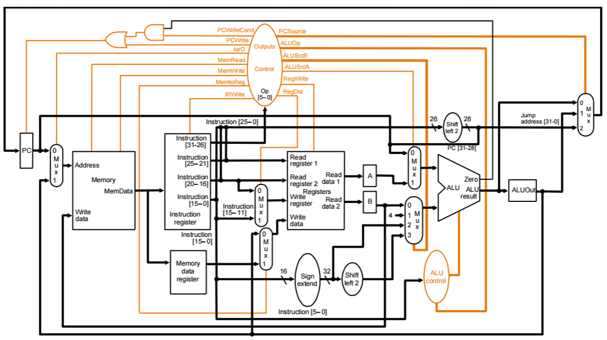
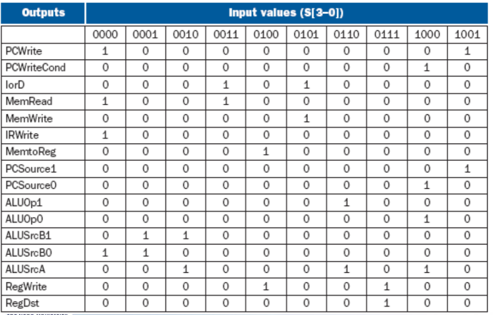
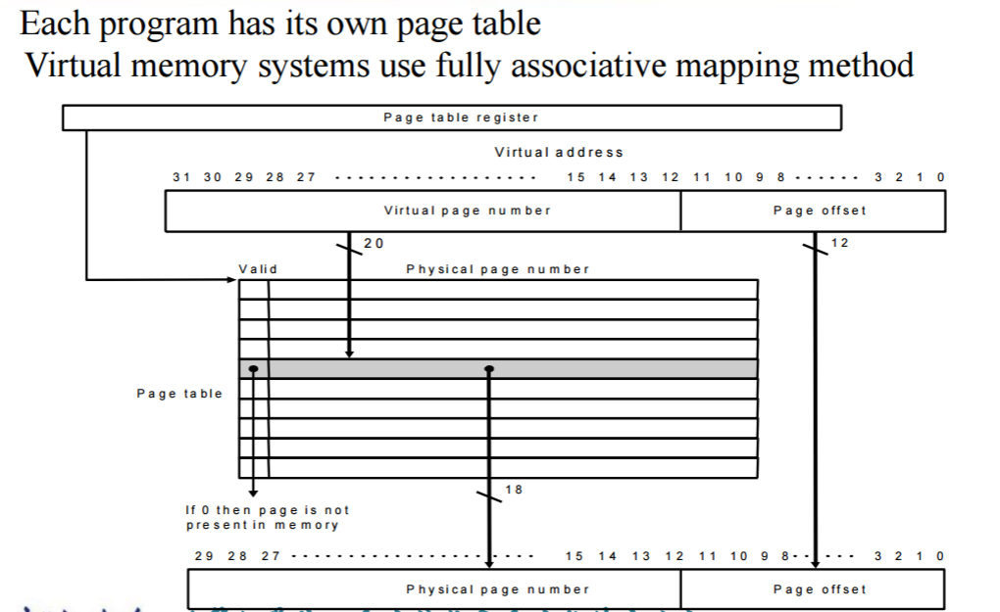
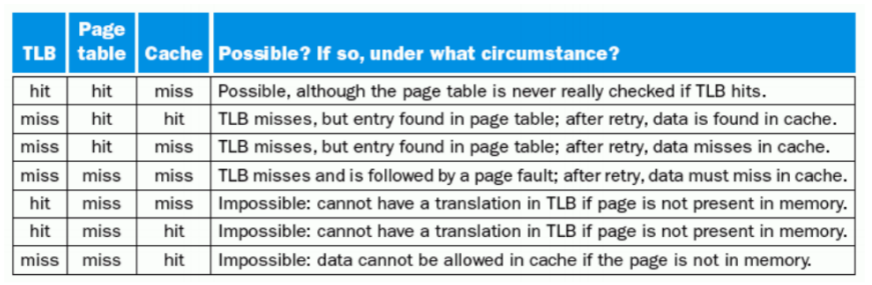

## MIPS相关

+ 移码（增码）：符号位取反的补码
	- 一般用指数的移码减一来做浮点数的阶码

+ IEEE754 标准
	- `float`  （1位符号位 + 8位指数位 + 23位底数位）
		+ 其中，指数位 `实际值 = 显示值 - 127`
	- `double` （1位符号位 + 11位指数位 + 52位底数位）

+ MIPS指令
	- `beq $rs, $rt, offset`
		+ 注意此处顺序是**正**的。
		+ `offset` 是 新地址 和 PC+4 的差除以 4 后的结果。
	- `lw $rt, offset($rs)`
		+ 注意此处顺序是**反**的。
	- `sw $rt, offset($rs)`
		+ 注意此处顺序是**反**的。
	- `add $rd, $rs, $st`
	- `J Jumpaddr`
		+ 实际跳转地址 = `PC+4[31:28] + Jumpaddr[25:0] + 00`

+ 寄存器表
	|编号|寄存器|作用|
    |---|-----|----|
	|0|$zero||
    |1|$at|保留给汇编器|
 	|2-3|\$v0 , \$v1|函数调用返回值|
 	|4-7|\$a0 - \$a3|函数调用参数|
 	|8-15|\$t0 - \$t7||
    |16-23|\$s0 - \$s7||
 	|24-25|\$t8 , \$t9||
 	|26,27|\$k0 , \$k1|保留给异常处理函数|
 	|28|\$gp|全局指针|
 	|29|\$sp|堆栈指针|
 	|30|\$fp|帧指针|
 	|31|\$ra|返回地址|

+ 杂碎注意点
	- **寄存器里的负数值都是用补码表示的。**

##多周期

+ 多周期的步数
	

+ ALU 译码表

+ 多周期控制信号含义
	|信号名称|= 0 时候的含义|= 1 时候的含义|
    |-------|------------|------------|
    |RegDst|选 `rt[20:16]`|选 `rt[15:11]` |
    |RegWrite||对寄存器执行写操作|
    |ALUScrA|ALU 第一个值是PC|ALU第一个值来自寄存器 A|
  	|MemRead||从 memory 中读入|
    |MemWrite||输出到 memory |
    |MemtoReg|写入 reg 数据从 ALUout 来|写入 reg 数据从MDA来|
	|IorD|PC 来做访问的内存地址| ALUout 来做访问的内存地址|
    |IRWrite||内存输出到 IR 里去|
    |PCWrite||J指令的强制跳转|
    |PCWriteCond||如果 `ALU = 0`，branch 强制跳转|

    |信号名称|作用|00|01|10|11|
    |------|----|--|--|--|--|
    |ALUop|给 ALU 信息|加|减|其他||
    |ALUScrB|ALU 第二个值|B|4|位拓展的IR|位拓展的IR\*4|
    |PCSource|新 PC 被什么写|PC+4|branch|Jump|

+ 多周期数据通路
	

+ 多周期状态机控制信号表
	

## 存储

+ Locality
	- `temporal locality` (locality in time): If an item is referenced, it will tend to be referenced again soon.
	- `spatial locality` (locality in space): If an item is referenced, items whose addresses are close by will tend to be referenced soon.

+ Cache
	- 分类
        - Direct Mapped：取最后几个二进制位直接映射。
            + `TAG` 是前几个二进制位
            + 一个我们需求的地址由 `TAG + Index + offset` 组成
            + Cache里一个单位由 `Validbit + TAG + data` 组成
        - Fully associative
		- Set associative
			+ Direct Mapped 其实是一路组关联
	- Strategy of block Replacement
		+ Random replacement
		+ Least-recently used (LRU)
		+ First in,first out(FIFO)
	- Write hit：
		+ `write-back` (Cause Inconsistent)： Wrote the data into only the data cache
		+ `write-through` (Ensuring Consistent)： Write the data into both the memory the cache
	- Write miss：
		+ read the entire block into the cache, then write the word
		+ `Write allocate`：The block is loaded into the cache on a miss before anything else occurs
		+ `Write around`：The block is only written to main memory (not stored in the cache)

+ 虚拟内存
	- blocks of memory (called `pages`) are mapped from `virtual addresses` to `physical address`.
	- `page number` 决定 `physical address` 的高位， `page offset` 决定低位。
	- 每个 `page` 的大小一般是 4KB $\sim$ 16KB
	- 采用 `write back` 策略（频繁写入）
	- `page table` is indexed with the page number from the virtual address to discover physical address.
		+ 由 `valid bit` 和 `page number` 两部分组成。
		+ 位宽是 `physical page number` 的位宽加一（注意要向上填充）
		+ 如果 `valid bit = 0`，会产生 `page fault`。`

	
    - TLB (Translation-lookaside Buffer)：
    