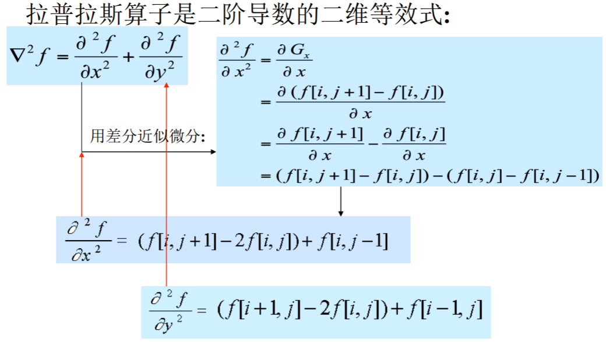
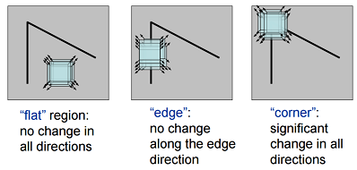
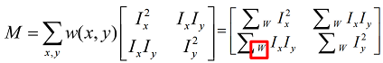
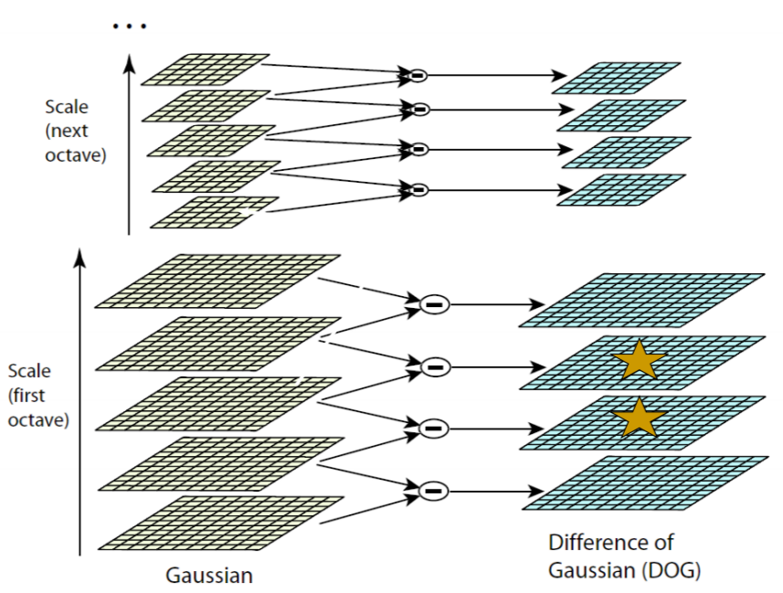
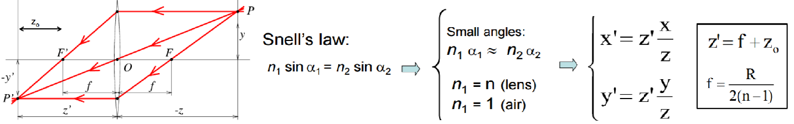
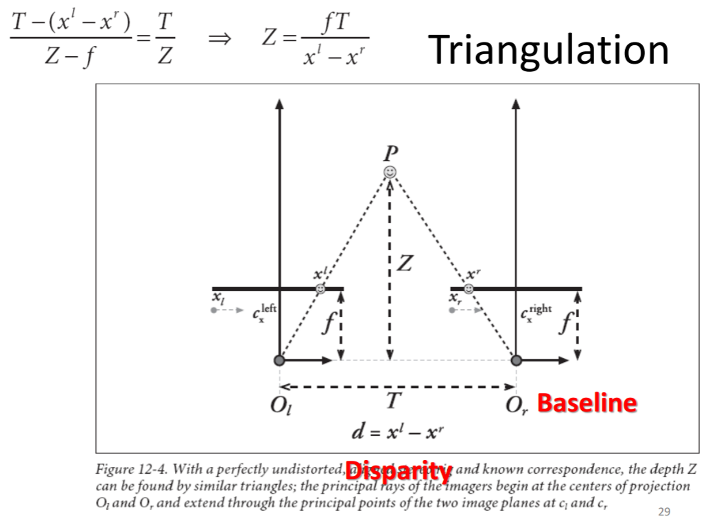
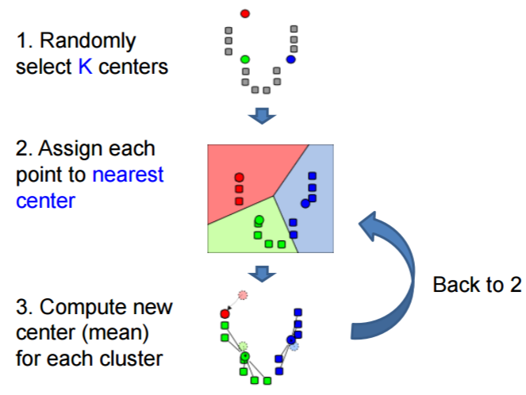

## Review of Class Computer Vision 计算机视觉复习

#### 引言

+   **Gestalt Laws（格式塔法则）**：出发点是形。
    +   Law of Proximity: 接近的物体容易被感知成同一组。
    +   Law of Similarity: 将相似的物体感知成同一组的部分。
    +   Law of Good Continuation: 沿着元素暗示的弧方向走。
    +   Law of Closure: 人们会把不完整的个体看成是一个整体的形状。
    +   Law of goodform : 希望图片由几个规则图形组成。
    +   Law of Figure/Ground: 区别前景和背景。
+   什么是计算机视觉？
    +   根据场景的图像实现场景中对象信息的恢复和利用。
+   五大研究内容
    +   输入设备
    +   底层视觉（图像处理）
    +   中层视觉（恢复场景，2.5 维）
    +   高层视觉（三维重建）
    +   体系结构
+   Marr 视觉表示框架
    +   信息处理分析的三个层次
        +   计算层：目的，策略。
        +   表示和算法层：实现这个计算。
        +   实现层：物理上实现。
    +   **视觉表示框架**：
        +   第一阶段 (Primal Sketch)：将输入的原始图像进行处理，抽取图像中诸如角点、边缘、纹理、线条、边界等基本特征， 这些特征的集合称为基元图； 
        +   第二阶段 (2.5D Sketch)：指在以观测者为中心的坐标系中， 由输入图像和基元图恢复场景可见部分的深度、法线方向、 轮廓等，这些信息包含了深度信息，但不是真正的物体三维表示，因此被称为二维半图； 
        +   第三阶段 (3D Model)：在以物体为中心的坐标系中，由输入图像、基元图、二维半图来恢复、表示和识别三维物体。

#### 二值图像

+   **几何特性**
    +   面积（零阶矩），区域中心（一阶矩）。
    +   方向（求方向用最小二乘法），伸长率 $E=\frac{\chi_{max}}{\chi_{min}}$，密集度 $C=\frac{A}{p^2}$
    +   欧拉数 (亏格数, genus) = 连通分量数减去洞数
    +   常用距离：欧几里德距离 (Euclidean) ，街区距离(block) ，棋盘距离，Minkowski 距离（p-norm distance）。
+   **投影计算**
    +   定义：给定一条直线，用垂直该直线的一簇等间距直线将一幅二值图像分割成若干条，每一条内像素值为1的像素的数量。
    +   水平投影，垂直投影。
    +   对角线投影：对角线标号 $d=ai+bj+c$
+   **连通区域**
    +   连通分量标记的序贯算法（二重循环+并查集）
    +   区域边界跟踪算法
    	- 从左到右、从上到下找到左上角的起点 $s$，初始化 $b$ 是它左侧的点。
    	- 从 $b$ 开始围绕 $c$ 逆时针旋转，设找过的点编号为 $n_i$。
    	- 当$n_i$的值是 $1$时停止，设 $c'=n_i,b'=n_{i-1}$，重复操作 $2$ 直到结束。
#### 边缘和边缘检测
+ 模板卷积
+ 四种最主要的不连续： 
    1. 表面法向量的不连续 
    2. 深度的不连续 
    3. 表面颜色的不连续
    4. 光照的不连续
+ 边缘检测基本思想：函数导数反映图像灰度变化的显著程度。一阶导数的局部极大值，或二阶导数的过零点。
    + 基于一阶导数的边缘检测
        + 幅值 $|G(x,y)|=\sqrt{\frac{\partial f}{\partial x}^2+\frac{\partial f}{\partial y}^2} \simeq |G_x|+|G_y| \simeq max{|G_x|,|G_y|}$
        + 梯度方向：$\alpha{x,y}=arctan(\frac{G_y}{G_x})$
        + 用差分近似偏导数：Roberts交叉算子，Sobel算子（左边$-1,-2,-1$ 中间全 $0$），Prewitt算子（左边 $-1,-1,-1$，中间全 $0$）
    + 基于二阶导数的边缘检测
        + 拉普拉斯（Laplacian）算子
            
        + LoG（Laplacian of Gaussian）边缘检测算法
            + 平滑滤波器是高斯滤波器。
            + 采用拉普拉斯算子计算二阶导数。
            + 边缘检测判据是二阶导数零交叉点并对应一阶导数的较大峰值。
            + 使用线性内插方法在子像素分辨率水平上估计边缘的位置。
            + **先做卷积再求二阶导 和 先对高斯滤波求二阶导再卷积 等价**。
+ Canny 边缘检测器
    1.  用高斯滤波器平滑图像
    2.  用一阶偏导有限差分计算梯度幅值和方向
        + $|G(x,y)|=\sqrt{G_x[i,j]^2+G_y[i,j]^2},\theta[i,j]=\arctan{\frac{G_y[i,j]}{G_x[i,j]}}$
    3.  对梯度幅值进行非极大值抑制（NMS）
    	
    4.  用双阈值算法检测和连接边缘
        + 高阈值：必然是边缘
        + 低阈值：必须和高阈值连通才算边缘

#### 局部特征 Local Feature

+ **Harris 角点检测**
    
    + Denote $E(u,v)=\sum \limits_{x,y} w(x,y)[I(x+u,y+u)-I(x,y)]^2$. The corner has bigger $E(u,v)$.
    + Using bilinear approximation, we can derive that:
        - $E(u,v)\approx[u,v]M[u,v]^\mathrm{T}$
        - 
        - $\lambda1 \sim \lambda2$: Corner
        - $\lambda1 \gg \lambda2$: Edge
    + Corner Response $\rm R=det(M)-k \cdot Trace(M)$, use $R$ to judge corners ($k \in [0.04,0.06]$).
        
    + Algorithm
        + Find points with large corner response function R (R > threshold) .
        + Take the points of local maxima of R
    + Property
        + Rotation invariance 旋转不变性
        + Partial invariance to affine intensity change 灰度仿射不变性
        + **But: non-invariant to image scale!**
    
+ Scale Invariant Detections
    + Given: two images of the same scene with a large scale difference between them.
    + Goal: find the same interest points independently in each image.
    + Solution: search for maxima of suitable functions in scale and in space (over the image).

Harris-Laplace
    + DoG: $D(x, y, \sigma) =(G(x, y, k \sigma)-G(x, y, \sigma)) \ast I(x, y) =L(x, y, k \sigma)-L(x, y, \sigma)$
        
        

+ **SIFT描述子的计算**

    + Full Version
        + Divide the 16x16 window into a 4x4 grid of cells.
        + Compute an orientation histogram for each cell
        + 16 cells * 8 orientations = 128 dimensional descriptor
    + SIFT Feature
        + Descriptor: 128-D: Normalized to reduce the effects of illumination change. 
        + Position: (x, y) 
        + Scale: Control the region size for descriptor extraction.
        + Orientation: To achieve rotation-invariant descriptor.
  + Merit
       + Desired property in invariance in changes of scale, rotation, illumination, etc. 
       + Highly distinctive and descriptive in local patch. Especially effective in rigid object representation. 
  + Drawback 
       + Time consuming for extraction
       + Poor performance for un-rigid object. Such as human face, animal, etc. 
       + May fail to work in severe affine distortion. 

#### 曲线
+ 和**边缘检测的关系**：将边缘连接起来就可以知道一个物体在二维平面上的投影边界，称这一边界为轮廓。

+ 链码用相邻边缘点组成的方向序列来表示边缘
    + 4-连通对应四方向链码
    + 8-连通对应八方向链码
    
    
+ 分线段 (多边形) 拟合：Douglas-Peucker算法 [Douglas73]
    + 对每一条离散曲线的首末点虚连一条直线，求所有点与直线的距离，并找出最大距离值 $dmax$，用 $dmax$ 与阈值 $D$ 相比：
    1. 若 $dmax＜D$，这条曲线上中间点全部舍去；
    2. 若 $dmax \ge D$，保留dmax对应的点，并以该点为界，把
曲线分为两部分，对这两部分重复使用该方法。
    
+ **Hough变换**

    + Hough变换是一种特征提取技术，基于投票 (Voting) 原理的参数估计方法，用来检测直线、圆等形状。
    + 基本想法：图像中每一点对参数组合进行表决，赢得多数票的参数组合为胜者。
    + 检测直线
        + 原图的一个点 $(x,y)$ 上会经过很多 $y=mx+c$ 的直线。我们写成 $c=-mx+y$ 的形式，做 $(x,y) \rightarrow (m,c)$ 的映射。
        + 这样，原图的每一个点就转换成了参数空间中的直线。
        + 避免垂直直线所带来的问题，通常采用极坐标表示： $(x,y)$ 空间到 $(\rho, \theta)$ 空间的变换。
        + 在参数空间开一个累加器。对于原图的每个点，把参数空间对应直线经过的点累加器都加一。最终我们再把参数空间里值最大的累加器点变换回原图，就可以表征原图最有可能的直线了。
    + 检测圆弧
        + 一个圆弧有 $(x,y,r)$ 三个参数。
        + 由 $a=x-r\cos\theta,b=y-r\sin\theta$ 得变换规则 ：$b=\tan\theta-x\tan\theta+y$（参数空间是 $(a,b)$）
        + 对于原图的每个点计算梯度角 $\theta$，并在对应参数空间维护累加器。做完后我们就得到了最有可能的圆心坐标。很容易反求出 $r$。

#### 人脸识别
+ Principal component analysis

    + It is a linear transformation that chooses a new coordinate system for the data.
    + PCA 定义
        + 数据在 $d$ 维空间 $x=(x1,x2,\dots,x_d)$
        + 我们想要找一些投影方向 $a_i$，使得 $a_i^\mathrm{T}a_i=1$ 且投影值 $z_k=a_k^\mathrm{T}x$ 的方差尽量大。
        + 同时限制 $cov(z_i,z_j)=0$，即每个新方向都与原方向无关。
    + PCA求解
        + 令 $S_{i,j}=E(x_ix_j)-E(x_i)E(x_j)$，则 $var(z_k)=a_k^\mathrm{T}Sa_k$
        + 我们要最大化 $var(z_k)=a_k^\mathrm{T}Sa_k$
        + 套用 Lagrange 乘子法后，转为最大化 $a_k^\mathrm{T}Sa_k-\lambda(a_k^\mathrm{T}Sa_k-1)$.
        + 求微分，得 $Sa_k-\lambda a_k=0$，即应该取 $S$ 的特征值。
    + 结论：求 $S$ 的前 $k$ 大特征值。对应的特征向量即为变换方式。

+ Eigenface 人脸识别方法
    + 步骤
        1. 对所有人脸图像作归一化处理。
        2. 通过 PCA 计算获得一组特征向量(特征脸)，将每幅人脸图像都投影到由该组特征脸张成的子空间中，得到在该子空间坐标。
        3. 对输入的一幅待测图像，归一化后将其映射到特征脸子空间中。用某种距离度量来描述两幅人脸图像的相似性，如欧氏距离。
    + 训练过程
        + 计算图片向量的均值 $\mu=\frac{1}{n}\sum \limits_{i=1}^n x_i$
        + 计算协方差矩阵 $S=\frac{1}{n}\sum \limits_{i=1}^n (x_i-\mu)(x_i-\mu)^T$
        + 求 $S$ 的特征点和特征向量并构建转换矩阵 $A=[v_1,v_2,\dots,v_k]$.

#### 图像频域与图像分解

+   Fourier Transform
    +   Fourier transform stores the magnitude and phase at each frequency.
    +   

#### 图像拼接 Image Stitching

+ 过程
    + Detect feature points in both images
        + Detect key points
        + Build the SIFT descriptors
    - Find corresponding pairs
    + Use these pairs to align the images (Fitting the transformation).
+ **RAN**dom **SA**mple **C**onsensus 每一次尝试的步骤：
  
    1. Randomly select a seed group of points on which to base transformation estimate.
    2. Compute transformation from seed group and find all inliers to this transformation.
    3. If the number of inliers is sufficiently large, recompute least-squares estimate of transformation on all of the inliers. (Keep the transformation with the largest number of inliers during loops.) 

+   分析
    +   假设内点的百分比是 $w$，需要 $n$ 个点来确定一个模型。
    +   重复 $k$ 次尝试一直失败的概率是 $(1-w^n)^k$
    +   Pros: 
        +   General method suited for a wide range of model fitting problems.
        +   Easy to implement and easy to calculate its failure rate.
    +   Cons: 
        +   Only handles a moderate percentage of outliers without cost blowing up 
        +   Many real problems have high rate of outliers (but sometimes selective choice of random subsets can help) 
    +   It is a voting strategy that can accept at most $50\%$ outliers $\rightarrow$ The Hough transform can handle high percentage of outliers.
+   Main flow for image Stitching
    +   Detect key points 
    +   Build the SIFT descriptors 
    +   Match SIFT descriptors 
    +   Fitting the transformation 
    +   RANSAC 
    +   Image Blending

#### Bag Of Words Model
+ 基本思想：假定对于一个文本，忽略其词序和语法、句法，仅仅将其看做是一些词汇的集合，而文本中的每个词汇都是独立的。
+ 在计算机视觉里的严格定义
    + Independent features
    + histogram representation
+ 基本步骤
    1. Feature extraction and representation
    2. Building codebook (codewords dictionary) from training samples with clustering
    3. Represent an image with histogram of codebook (i.e. Bag-of-words of an image)
    4. Classify an unknown image with its BoW.

#### 光流 optical flow

+   Optical flow is the apparent motion of brightness patterns in the image
+   GOAL: Recover image motion at each pixel from optical flow.
+   三个基本假设
    +   brightness constancy
    +   spatial coherence
    +   small motion
+   公式推导
    +   由假设，$I(x,y,t)=I(x+dx,y+dy,t+dt)$
    +   将右式泰勒展开：$I(x+dx,y+dy,t+dt)=I(x,y,t)+I_xdx+I_ydy+I_tdt+\epsilon$
    +   全都除以 $dt$，并设 $u=\frac{dx}{dt},v=\frac{dy}{dt}$，则 $I_xu+I_yv+I_t=0$

#### Camera

+ **Depth of Field（景深，DOF）**
    - 能够取得清晰图像的成像所测定的被摄物体前后距离范围。
	- Changing the aperture size affects depth of field
	    - A smaller aperture increases the range in which the object is approximately in focus
	    - But small aperture reduces amount of light – need to increase exposure
	- 光圈越大，景深越小；镜头焦距越长，景深越小。
+ **Field of View (视场，FOV)**
  
    + FOV depends of Focal Length $\phi=\tan^{-1}{\frac{d}{2f}}$
+ **Pinhole camera**
    - Because the point is not exactly at the center, we should add shift parameters $c_x$ and $c_y$. So that $x'=f_xx+c_x, y'=f_yy+c_y$.
	    
	- Why the **aperture**（孔径，光圈） cannot be too small?
	    - Less light passes through
	    + Diffraction effect
+ Lenses
    + For thin lense:
    
- **intrinsic parameters**
    + From Pinhole Camera Model, totally $4$ parameters. Use the trick of **Homogeneous Coordinates**, finally:
        
- **extrinsic parameters**
    + rotation and translation
    
    + $6$ parameters: $(\theta, \phi, \psi, c_x, c_y, c_z)$
- **distortion parameters**
    + Radial distortion
        + caused by the geometry of the lens and aperture position.
    	
    	
    + Tangential distortion
        + caused by the decentering of the optical component (assembly process)
            
            
        + $5$ parameters: $(k1,k2,k3,p1,p2)$
- Total Transformation
    + Without distortion, the transform matrices are as follows:
          
    + Steps
        
- Camera Calibration
    - Compute relation between pixels and rays in space.
    1. Self-Calibration
        + Do not use any calibration object. Moving camera in static scene.
        + Very flexible, but not reliable
    2. 3D reference object-based Calibration
        + Can be done very efficiently, but expensive calibration apparatus and elaborate setup required.
    3. **Calibration by Homography**
        + Pros: 
            1. Consider flexibility, robustness, and low cost.
            2. Only require the camera to observe a planar pattern shown at a few (minimum 2) different orientations.
            3. More flexible and robust than traditional techniques.
        + 步骤：
            1. Calibration object: we know positions of corners of grid with respect to a coordinate system.
            2. Find the corners from images.
            3. Construct the equations.
            4. Solve the equations to get the camera parameters.
        + 注意事项：
            + 这个系统里有 $10$ 个参数，但是二维图像变换的齐次坐标的自由度只有 $8$。即若只有一组照片，取再多的点都不能求出所有参数。
            + 假设取了 $k$ 组图像，每组图像  $N$ 个点，共获得了 $2Nk$ 个约束。
            + 总参数是 $6k+4$，则 $2Nk \ge 6k+4$

#### Stereo Vision 立体视觉

+   **Triangulation**
    
    
+   四个基本步骤
    1. Undistortion: remove distortions -> undistorted images.
    2. Rectification: adjust cameras -> the two images row-aligned
    3. Correspondence:  find the same features in the two images -> disparity – Reprojection
    4. triangulation -> a depth map
    
#### 结构光

#### 图像分割

+   **Clustering**: group together similar points and represent them with a single token
    +   Summarizing data 
        +   Look at large amounts of data
        +   Patch-based compression or denoising
        +   Represent a large continuous vector with the cluster number
    +   Counting 
        +   Histograms of texture, color, SIFT vectors
    +   Segmentation 
        +   Separate the image into different regions
    +   Prediction
        +   Images in the same cluster may have the same labels.
+   **K-means algorithm**
    + Steps
        
    + Pros: Simple and fast; Easy to implement
    + Cons: Need to choose K; Sensitive to outliers
+   **Mean Shift**
    +   The mean shift algorithm seeks modes of the given set of points.
    +   Steps: 
        1. Choose kernel and bandwidth 
        2. For each point: a) Center a window on that point b) Compute the mean of the data in the search window c) Center the search window at the new mean location d) Repeat (b,c) until convergence 
        3.  Assign points that lead to nearby modes to the same cluster
    +   Pros
        +   Good general-purpose segmentation
        +   Flexible in number and shape of regions
        +   Robust to outliers 
    +   Cons
        +   Have to choose kernel size in advance 
        +   Not suitable for high-dimensional features
