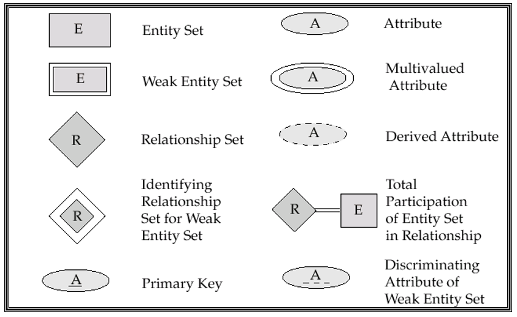
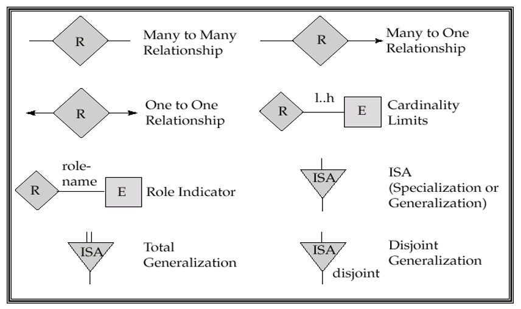
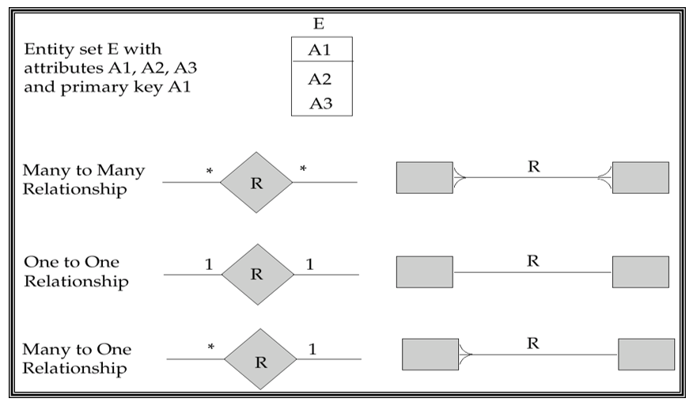

##### relational-algebra expression

- 基本功能
    + $\cup, -,$ 并，差
    + $r \times s = \{(t,q) | t \in r, q \in s \}$：笛卡尔积
    + $\rho_X(r)$: 将 $r$ 重命名为 $X$。
    + $\sigma_X(r)$：选取 $r$ 中符合条件 $X$ 的记录。
    + $\prod_{X,Y}(r)$：投影 $r$ 中的部分属性。

- 拓展功能
	+ $r \cap s = r - (r - s)$ 交
	+ $r \Join s$ 自然连接
	+ $r \Join_{\theta} s$ 带条件连接


## MySQL语法

##### 约束（Constraints）

1. 普通约束
	+ `not null`
	+ `unique`
	+ `check()`
	+ `create assertion <name> check()`

2. 键约束
	+ 单一主键 `id numeric(4,0) primary key`
	+ 复合主键 `primary key(...)`
	+ 外键 `foreign key (name1) references name2`
		+ 可以添加 `on delete/update cascade` 来定义 transaction

##### 函数和过程（Functions and Procedures）

1. 函数
	+ 定义
    ```SQL
        create fuction <fuc_name>(参数列表) returns (返回参数列表)
            return(返回值列表)
    ```
	`return` 前后可以加`begin`和`end`

	+ 调用
    ```SQL
        select * from table(<fuc_name>(参数列表))
    ```

2. 过程
	+ 定义
	```SQL
		create procedure <fuc_name>(in name varchar(20), out ans integer)
			select count(*) into ans from dict
			where dict.name == name
	```
	+ 调用
	```SQL
		declare cnt integer;
		call <fuc_name>('Bob', cnt)
	```

##### 常用语法

1. 基本语法
	+ 定义变量： `declare n integer`
	+ 赋值： `set A = B;`
	+ 删除表 $r$ 中的属性 $A$： `ALTER TABLE r DROP A `
	+ 选择时： `select distinct/all` 不能重复/需要重复
	+ `Group by` 
		- 注意：Attributes in select clause outside of aggregate functions must appear in group by list.
		- 如：
		```SQL
              SELECT branch_name, avg(balance) avg_bal
              FROM account
              GROUP BY brach_name
        ```
        - `HAVING ...` 用来对 `group by` 之后的结果选择
    + 按某属性排序： `order by ...` 结尾加：`asc` 升序 `desc` 降序。
	+ `where` 中可以加的表达式：`AND`, `OR`, `NOT`, `BETWEEN ... AND ...`
	+ 字符串
		- 连接： `||`
		- 正则表达式： `where A LIKE ...`
			+ `%` 匹配任意字符
			+ `_` 匹配任意字符串
	+ 集合操作
		- `UNION`
		- `INTERSECT`
		- `EXCEPT`
	+ 一些函数
		- `avg, sum, count, min, max`
		- 用 `GROUP BY` 来聚合
		- `Having ...` 一般跟在 `GROUP` 后面用来描述条件
	+ `with ... as ...` 局部定义（类似于函数）
	+ 修改表 $A$ 中数据

2. 分支结构
	```SQL
	if boolean_expression
		then compound_statement
	else if boolean_expression
		then compound_statement
	else compound_statement
	end if
	```
3. 循环结构

	+ for
	```SQL
		declare n integer default 0;
		for r as
			selet budget from department
			where dept_name == 'Music'
		do
			set n = n - r.budget
		end for
	```
	+ while
	```SQL
		while boolean_expression do
			statements;
		end while
	```
	+ repeat
	```SQL
		repeat
			statements;
		until boolean_expression
		end repeat
	```

##ER模型

+ 符号和约定

	
    
    

