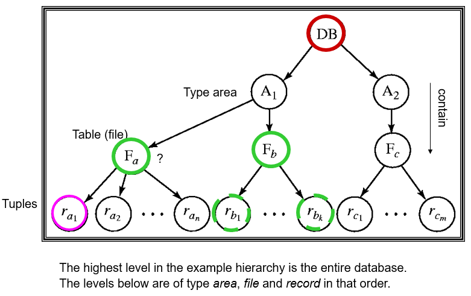

## 事务（Transaction）

+ 概念：a unit of program execution that accesses and possibly updates various data items.
+ 在 `transaction` 期间数据可以不一致，结束后必须一致。
+ 四个特性：
	- Atomicity.
	- Consistency.
	- Isolation.
	- Durability.
+ Transaction state
	
    - `aborted`: `roll back` 结束后返回到的初始状态。
+ The shadow-database scheme
	- 始终指向正确的数据库。
	- 每次 `update` 时新开一个 `new copy` 来更新。`commit` 了后再指向新的。
+ Concurrent Executions（并发）
	- `Schedules`
		+ indicate the chronological order in which instructions of concurrent transactions are executed.
		+ `Serial schedule` (串行调度)：必能保证一致性，但是低效。
	- `Conflict Serializability`（可串行化）
		+ 若2个操作是有冲突的，则二者执行次序不可交换；若2个操作不冲突，则可以交换次序。
		+ 如果 `S` 可以通过交换次序到达 `S'`，称它们 `conflict equivalent`.
		+ 如果 `S` 是等价于 `serial schedule`，称为 `conflict serializable`.
	- `View Serializability`
+ Recoverability
	- `Recoverable schedule` — if a transaction $T_j$ reads a data item previously written by a transaction $T_i$ , then the commit operation of $T_i$  appears before the commit operation of $T_j$.
	- `recover` 会导致 `Cascading rollback `.
	- `Cascadeless schedules` — $T_j$ reads a data item previously written by  $T_i$, the commit operation of $T_i$ appears before the read operation of $T_j$.

## 并发控制（Concurrency Control）
+ Lock-Based Protocols
	- `Exclusive (X) mode`: 只允许事务 T 读取和修改，其他任何事务都不能读取、写入和加锁，直到 T 释放。
    - `Shared (S) mode`: 允许 T 读但不能修改，其他事务只能加 S 锁但不能加 X 锁，直到 T 释放。
    - `deadlock`：双方都施加过 S 锁，想申请 T 锁时都要等待对方释放。

      |.|S|X|
      |-|-|-|
      |S|T|F|
      |X|F|F|
    - `strict two-phase locking` 事务结束前不能释放锁。

+ Graph-Based Protocols
	- If $d_i \rightarrow d_j$  then any transaction accessing both $d_i$ and $d_j$ must access $d_i$ before accessing $d_j$.
	- `Tree Protocol`
		+ 只有 $X$ 锁。
		+ 事务 $T$ 第一次可以给任何点加锁，之后给点 $t$ 加锁时必须保证 $t$ 的父亲目前被 $T$ 锁住。
		+ 一个 `item` 可以在任何时候被解锁，但不能重新再上锁。
	- 优缺点
		+ 保证了 `conflict serializability`，防止了 `deadlock`。
		+ 不保证 `recoverability`，增加了无用的 `lock`。

+ Multiple Granularity（多粒度）
	- 描述成一个树结构
	
    - 意向锁
    	+ `Intention-shared` (IS，共享型意向锁)
    	+ `Intention-exclusive` (IX ，排它型意向锁)
    	+ `Shared and intention-exclusive` (SIX，共享排它型意向锁)
    - Compatibility Matrix
    
    
    - Transaction Ti can lock a node Q, using the following rules:
		1. The lock compatibility matrix must be observed.
		2. The root of the tree must be locked first, and may be locked in any mode.
		3. A node Q can be locked by Ti in S or IS mode only if the parent of Q is currently locked by Ti in either IX or IS mode.
		4. A node Q can be locked by Ti in X, SIX, or IX mode only if the parent of Q is currently locked by Ti in either IX or SIX mode.
		5. Ti can lock a node only if it has not previously unlocked any node (that is, Ti is two-phase).
		6. Ti can unlock a node Q only if none of the children of Q are currently locked by Ti.

## 恢复（Recovery）

+ **Log-Based Recovery**
	- 语法
		+ `<Ti start>`，`<Ti commit>`，`<Ti abort>`
		+ `<Ti, X, V1, V2>` X 从 V1 变成了 V2（在输出操作前）
		+ `<Ti, X, V>` 将 X 以值 V 输出。
		+ `checkpoint <L1, L2 ...>` 设立断点，将所有数据保存下来
	- 分类
		+ Deferred Database Modification（所有写操作在 `commit` 后进行）
		+ Immediate Database Modification（后来的讨论都是针对它）
	- 先进行 `undo` 操作（有 `start` 无 `commit`）再进行 `redo` 操作（有 `start` 有 `commit`）
	- `recover` 时，只有那些在最近一次 `checkpoint` 里或者之后开始的事务，才需要对其 `redo` 或者 `undo`。

	- 并发恢复
		
        

+ ARIES：a state of the art recovery method

## XML

+ `<tagname>...</tagname>` 嵌套时必须严格匹配
+ XML 主要用于数据传输
+ 元素（Element）
	- 元素可以拥有一些属性（attribute）
        + 用 `name = value` 标注
        
    - 元素中还可以定义 子元素（Subelement）
    	+ use attributes for identifiers of elements, and use subelements for contents.

+ 用命名空间来防止变量名重复
	
+ 用 `![CDATA[...]]` 套起来的是不套用XML语法的纯字符串

+ Document Type Definition (DTD)
	- 不含有类型（全以字符串储存）
	- 语法
		+ `<!ELEMENT element (subelements-specification)>`
		+ `<!ATTLIST element (attributes)>`
	- ELEMENT 定义规则
		
    - ELEMENT 支持正则表达式
    	
    - Attribute 定义规则
    	

+ XPath
	- Result of path expression:  set of values that along with their containing elements/attributes match the specified path.
	- 查询 []
		+ `/bank-2/account[balance > 400]`：Returns account elements with a balance value greater than 400. 
		+ `/bank-2/account[balance]`：Returns account elements containing a balance sub-element.
	- 选择 attribute @
		+ `/bank-2/account[balance >400] /@account_number`：Returns the account numbers of accounts with balance > 400.
	- 并操作 |
	- 跳过一级目录 `//`
	- `ID` 和 `IDREF`
		+ 可以给attribute一个唯一的 `ID` 值，这样如果有个地方有一个 `IDREF`，就可以实现联系和跳转。
		+ `IDREFS` 可以建立与 0 或 多个 `ID` 的联系。

+ XQuery
	- 基本语法
	
    - FLWOR Syntax
    
    - join 操作
		
		+ 这句话等价于
		

