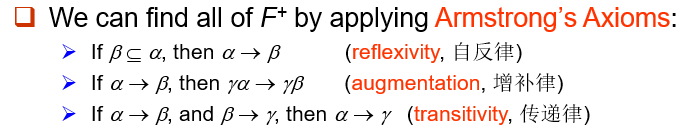
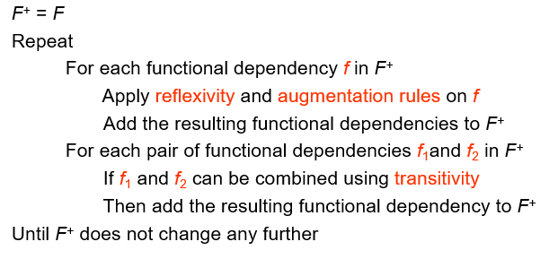
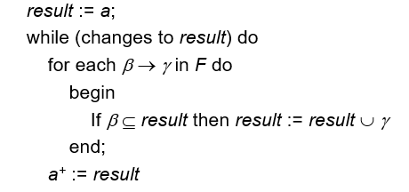
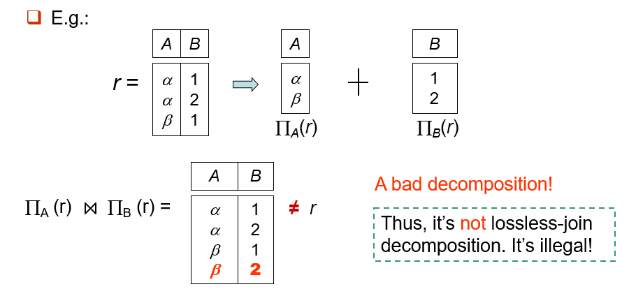
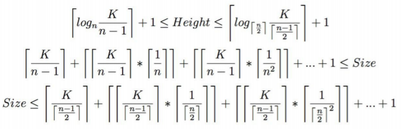
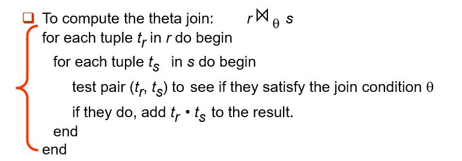
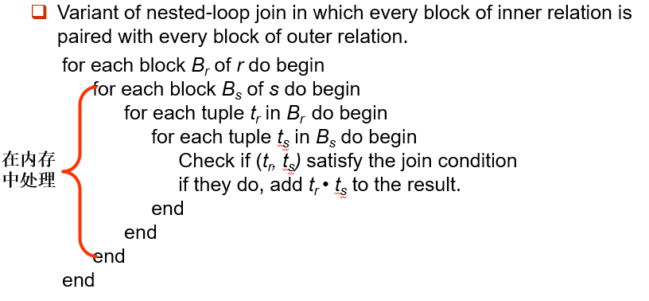

## 范式理论

+ **第一范式（First Normal Form，1NF）**
	- 定义：所有 Domain 都是不可分的（atomic）。
	- 关系型数据库要求都是满足 1NF 的。

+ **函数依赖（Functional dependency）**
	- 函数依赖 $\alpha \rightarrow \beta$ 在 $R$ 上成立，当且仅当对于所有关系 $r(R)$，$\forall (t_1,t_2)$
		$$ t_1(\alpha)=t_2(\alpha) \Rightarrow t_1(\beta)=t_2(\beta)$$
		$\alpha$ 的值确定了，那么 $\beta$ 的值也确定了。
    - 举例：比如主键 K 能推出所有属性。
	- 如果一个函数依赖集 $F$ 对于所有 $r$ 成立，则称 $F$ 在 $R$ 上成立。
	- $F$ 能推出的极大函数依赖集，称为 $F$ 的闭包（closure），记作 $F^+$。

+ 函数依赖集闭包
	- **Armstrong’s 公理**
		
	- 推导 $F^+$
		
	- 属性 $a$ 在 $F$ 下的闭包记为 $a^+$。
		+ 求 $a^+$ 的方法
			
	- 检验
		+ $a$ 是否是 `super key`。 $R \subseteq a^+$
		+ $\alpha \rightarrow \beta$ 是否成立。$\beta \subseteq \alpha^+$

+ **正则覆盖（Canonical Cover）**
	- 函数依赖集 $F$ 的“最小表示”。
	- 三种去重方式：
		+ 能被别的函数依赖直接推出的。
		+ 在箭头左侧的对象，可能可以变少。
		+ 在箭头右侧的对象，可能可以因为拆开后重复导致变少。
	- **无关属性（Extraneous Attributes ）：**
		$\quad$ 首先设 $\{ \alpha \rightarrow \beta \} \subseteq F$。
		1. 称 $A$ 是 $\alpha$ 的无关属性（$A \in \alpha$），如果 $F$ 能推出 $F'=\{F-\{\alpha \ \beta\}\} \cup \{(\alpha-A) \rightarrow \beta\}$
			+ 检验：$\beta \subseteq (\alpha -A)^+$
		2. 称 $A$ 是 $\beta$ 的无关属性（$A \in \beta$），如果 $F'=\{F-\{\alpha - \beta\}\} \cup \{\alpha \rightarrow \{\beta -A \}\}$ 能推出 $F$。
			+ 检验：$A \in \alpha^+$
	- 正则覆盖过程：每次去掉无关属性。

+ **分解（Decomposition）**
	- 将 Schema $R$ 分解成 $(R1，R2)$，必须满足 $R1 \cup R2 =R$。
	- **无损连接分解（Lossless-join decomposition）**：
	对于 Schema $R$ 的所有关系 $r$，满足 $\prod_{R1}(r) \Join \prod_{R2}(r) =r$
	
		+ 二元分解的判定：以下依赖在 $F^+$ 至少有一个成立：
			$$\{R_1 \cap R_2 \} \rightarrow R_1$$
			$$\{R_1 \cap R_2 \} \rightarrow R_2$$
	- 依赖保持（Dependency preservation）
		+ $(\cup F_i)^+ = F^+$

+ **BCNF（Boyce-Codd Normal Form）**
	- 定义：对于 $F^+$ 里的每一个非 trival 的 $\alpha \rightarrow \beta$，满足 $\alpha$ 是 $R$ 里的 super key。
	- 注意：只检验 $F$ 和检验 $F^+$ 是在 $R$ 处等价，在分解 $R_i$ 处不等价。

+ **Third Normal Form (3NF)**
	- 定义：对于 $F^+$ 里的每一个非 trival 的 $\alpha \rightarrow \beta$，至少满足以下的某一条：
	 	+ $\alpha$ 是 $R$ 里的 super key。
	 	+ $\forall A \in \{\beta - \alpha\}$， $A$ 包含于 $R$ 的一个 candidate key 里。
	- 一定存在一种满足函数依赖、所得关系都是第三范式的无损连接分解。

## 索引

+ Two basic kinds of indices:
	- Ordered indices
		1. + `Clustering(Primary) index（聚集索引）`
		   + `Secondary index`
		2. + `Dense index (稠密索引)`
		   + `Sparse index (稀疏索引)`
		   + `Sparse index` 只能用于顺序文件, 而 `dense index` 可以用于顺序和非顺序文件，如构成索引无序文件。
		3. + `Secondary Indices(辅助索引)`

	- Hash indices

+ B+ 树
	- 实时满足的性质
		+ 对于 $M$ 阶 `B+树` ，每个节点拥有最多 $M$ 个孩子，$M-1$ 个键值。
		+ 对于叶节点，储存 $\lceil \frac{M-1}{2} \rceil \sim M-1$ 条记录。
		+ 任意一个非根非叶节点，有 $\lceil \frac{M}{2} \rceil \sim ~ M$ 个孩子。
		+ 如果根不是叶节点，至少要有两个孩子。
	- 高度和size的估算
	

## 查询

+ Measures of Query Cost
	- cost：
		+ $t_T$ – time to transfer one block.  (≈ 0.1ms)
		+ $t_S$ – time for one seek.  (≈ 4ms)
		+ Cost for b block transfers plus S seeks：$b \times t_T + S \times t_S $

	- **cost for selection**:
		+ 不使用 `index`
			- linear search：$b_r$ block transfers, 1 seek
			- binary search: $\lceil \log_2(b_r) \rceil$ `block transfer` + $\lceil \log_2(b_r) \rceil$ `seek`
			  如果不是 `key`，`block transfer`要额外加上 $ex = \lceil \frac{b_r}{f_r} \rceil - 1$
		+ 使用 `index`
			- 用`key`：$(h_i + 1)$ `block transfer` + $(h_i + 1)$ `seek`。
			- 非 `key` 同样也要加上 $ex$ 个`block transfer`.。
		+ 非等值查询一般用 `linear search`。
		+ 查询 Conjunction ：根据耗时最少的条件找到记录并 `check` 剩余。
		+ 查询 Disjunction ：直接暴力查询，除非所有条件都有 `index`。

	- **cost for join**:
		+ Nested-Loop Join
			
            - 最坏情况：$n_r \times b_s + b_r$ `transfer`， $n_r + b_r$ `seek`
            - 最好情况：$b_r + b_s$ `transfer`，$2$ `seek`
        + Block Nested-Loop Join
        	
            - 最坏情况 $b_r \times b_s + b_r$ `transfer`。
        	- Let the relation with smaller number of blocks be outer relation.
        	- 最好情况：与上同理。
        + Indexed Nested-Loop Join
        	- `inner relation` 要有索引。
        	- 枚举每一个 $n_s$，用索引去找符合要求的 $t$。
        	- 代价：$b_r (t_T + t_S) + n_r \times c$
        + Merge-Join（排序归并连接）
        	- $br + bs$  `transfers`  ， $\lceil \frac{b_r}{b_b} \rceil + \lceil \frac{b_s}{b_b} \rceil$ `seeks`
        + Hash-Join Algorithm
        	1. 对 $s$ 用外层哈希对 $r$ 和 $s$ 进行 `Partition`。
        	2. 对每一个 $s_i$ 进行 `in-memory hash`.
        	3. 对每一个 $t_i$，找到对应的 $s_i$。
        	- $s$ 称为 `build input`，$t$ 称为 `probe input`。
			- 一般 $n = \lceil \frac{b_s}{M}\rceil  * f $，$f = 1.2$。
			- 代价大概是 $3(b_r+b_s)$
			- 如果 $n>M$，进行 `Recursive partitioning`。

+ Cost Estimation
	- Statistical Information
        + $n_r$ : number of tuples in a relation r.
        + $b_r$ : number of blocks containing tuples of r.
        + $l_r$ : size of a tuple of r.
        + $f_r$ : blocking factor of r — i.e., the number of tuples of r that fit into one block.
        + $V(A, r)$ : number of distinct values that appear in r for attribute A;  same as the size of $\prod_A(r)$.
        + If tuples of $r$ are stored together physically in a file, then:
            $$ b_r = \lceil \frac{n_r}{f_r} \rceil $$
    - Selection Size Estimation
    	+ $\sigma_{A=v}(r) : \frac{nr}{V(A,r)}$

