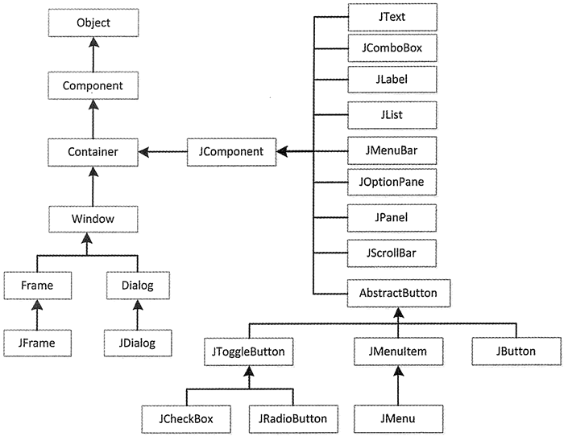

## Swing 和容器



```Java
import java.awt.*;
import javax.swing.*;
```

+ Swing 提供了许多比 AWT 更好的屏幕显示元素，使用纯 Java 实现，能够更好的兼容跨平台运行。
+ 创建图形用户界面程序的第一步是创建一个容器类以容纳其他组件，常见的窗口就是一种容器。容器本身也是一种组件，它的作用就是用来组织、管理和显示其他组件。
+ 三种顶层容器
	- JFrame：用于框架窗口的类，此窗口带有边框、标题、关闭和最小化窗口的图标。带 GUI 的应用程序至少使用一个框架窗口。
	- JDialog：用于对话框的类。
	- JApplet：用于使用 Swing 组件的 Java Applet 类。
+ 中间容器
	- JPanel：表示一个普通面板，是最灵活、最常用的中间容器。
	- JScrollPane：与 JPanel 类似，但它可在大的组件或可扩展组件周围提供滚动条。
	- JTabbedPane：表示选项卡面板，可以包含多个组件，但一次只显示一个组件，用户可在组件之间方便地切换。
	- JToolBar：表示工具栏，按行或列排列一组组件（通常是按钮）。

## JFrame

+ 新建 JFrame 对象
	- JFrame()：构造一个初始时不可见的新窗体。
	- JFrame(String title)：创建一个具有 title 指定标题的不可见新窗体。
+ 要通过内容窗格来添加组件：frame.getContentPane().add(b);
+ 常见方法
	|方法名称|功能|
  |------|----|
	|getContentPane()|返回此窗体的 contentPane 对象|
	|getDefaultCloseOperation()|返回用户在此窗体上单击“关闭”按钮时执行的操作|
	|setContentPane(Container contentPane)|设置 contentPane 属性|
	|setDefaultCloseOperation(int operation)|设置用户在此窗体上单击“关闭”按钮时默认执行的操作|
	|setDefaultLookAndFeelDecorated (boolean defaultLookAndFeelDecorated)|设置 JFrame 窗口使用的 Windows 外观（如边框、关闭窗口的 小部件、标题等）|
	|setIconImage(Image image)|设置要作为此窗口图标显不的图像|
	|setJMenuBar( JMenuBar menubar)|设置此窗体的菜单栏|
	|setLayout(LayoutManager manager)|设置 LayoutManager 属性|

## Graphics

+ The Graphics class contains the methods for drawing strings and shapes.
+ drawString(s, x, y). (0, 0) is the left-up corner.
+ drawLine(x1, y1, x2, y2)
+ Draw shapes
  + drawRect(x, y, w, h) 
  + fillRect(x, y, w, h)
  + drawRoundRect(x, y, w, h, aw, ah)
  + drawOval(x, y, w, h)
  + drawArc(int x, int y, int w, int h, int startAngle, int arcAngle)
  + drawPolygon(Polygon polygon)
    + polygon.addPoint(40, 20);
    + Polygon polygon = new Polygon();

## JPanel

+ JPanel 是一种中间层容器，它能容纳组件并将组件组合在一起，但它本身必须添加到其他容器中使用
	- JPanel()：使用默认的布局管理器**FlowLayout**创建新面板。
	- JPanel(LayoutManagerLayout layout)：创建指定布局管理器的 JPanel 对象。
	
+ 常用方法
	|方法名及返回值类型|说明|
  |---------------|---|
	|Component add(Component comp)|将指定的组件追加到此容器的尾部|
	|void remove(Component comp)|从容器中移除指定的组件|
	|void setFont(Font f)|设置容器的字体|
	|void setLayout(LayoutManager mgr)|设置容器的布局管理器|
	|void setBackground(Color c)|设置组件的背景色|

## Layout Manager

+ Each container must have a layout manager. 

+ 边框布局管理器 BorderLayout
	
	- Window、JFrame 和 JDialog 的默认布局管理器。
	- 将窗口分为 5 个区域：North、South、East、West 和 Center。
	- 如果未指定位置，则缺省的位置是CENTER
	- **不一定需要所有组件，自动填充**
	
+ 流式布局管理器 FlowLayout
	- JPanel 和 JApplet 的默认布局管理器。
	- 将组件按照从上到下、从左到右的放置规律逐行进行定位。
	- 不限制它所管理组件的大小，而是**允许它们有自己的最佳大小**。
	- 初始化：`FlowLayout([int align[, int hgap,int vgap]])`： align 表示组件的对齐方式（FlowLayoutLEFT、FlowLayout.RIGHT 和 FlowLayout.CENTER）；hgap 表示组件之间的横向间隔；vgap 表示组件之间的纵向间隔，单位是像素。
	
+ 卡片布局管理器 CardLayout
	- 多个成员共享同一个显示空间，并且一次只显示一个容器组件的内容。
	- 将容器分成许多层，每层的显示空间占据整个容器的大小，但是每层只允许放置一个组件。
	- ```Java
		JPanel cards = new JPanel(new CardLayout());
        JPanel t = new JPanel();
        cards.add(t, "name")
    ```
  
+ 网格布局管理器 GridLayout
	- 将区域分割成行数（rows）和列数（columns）的网格状布局，组件按照由左至右、由上而下的次序排列填充到各个单元格中。
	- `GridLayout(int rows,int cols[,int hgap,int vgap])`：创建一个指定行（rows）和列（cols）的网格布局，并且可以指定组件之间横向（hgap）和纵向（vgap）的间隔，单位是像素。
	- GridLayout 布局管理器总是忽略组件的最佳大小，而是根据提供的行和列进行平分。该布局管理的所有单元格的宽度和高度都是一样的。
	
+ 网格包布局管理器 GridBagLayout
	- 是在网格基础上提供复杂的布局，是最灵活、 最复杂的布局管理器。
    - 不需要组件的尺寸一致，**允许组件扩展到多行多列**。
  
+ 盒布局管理器 BoxLayout
	- `BoxLayout(Container c,int axis)`：参数 Container 是一个容器对象，即该布局管理器在哪个容器中使用；第二个参数为 int 型，用来决定容器上的组件水平（X_AXIS）或垂直（Y_AXIS）放置，可以使用 BoxLayout 类访问这两个属性。
	- createHorizontalBox()：返回一个 Box 对象，它采用水平 BoxLayout
	- createVerticalBox()
	- 使用盒式布局可以像使用流式布局一样简单地将组件安排在一个容器内。包含盒式布局的容器可以嵌套使用，最终达到类似于无序网格布局那样的效果。

## 监听

+ 事件处理
	- Event（事件）：用户对组件的一次操作称为一个事件，以类的形式出现。
	- Event Source（事件源）：事件发生的场所，通常就是各个组件，例如按钮 Button。
	- Event Handler（事件处理者）：接收事件对象并对其进行处理的对象事件处理器，通常就是某个 Java 类中负责处理事件的成员方法。
+ 动作事件处理器
	- 事件名称：ActionEvent。
	- 事件监听接口: ActionListener。
	- 相关方法：addActionListener() 添加监听，removeActionListener() 删除监听。
	- 涉及事件源：JButton、JList、JTextField 等。
+ 焦点事件监听器
	- 事件名称：FocusEvent。
	- 事件监听接口： FocusListener。
	- 相关方法：addFocusListener() 添加监听，removeFocusListener() 删除监听。
	- 涉及事件源：Component 以及派生类。
	- FocusEvent 接口定义了两个方法，分别为 focusGained() 方法和 focusLost() 方法，其中 focusGained() 方法是在组件获得焦点时执行，focusLost() 方法是在组件失去焦点时执行。
