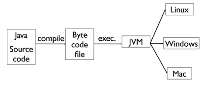
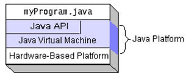
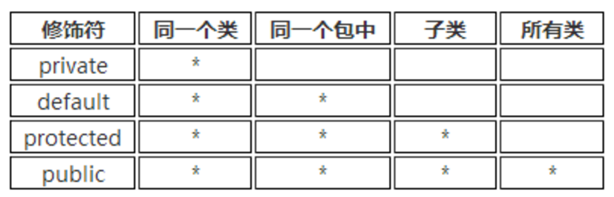

## 概况

+ Features
	- A compiled language
	- A productive OOP language
	- a **type-safe** and stable language
	- No point
    - Index check
    - Auto memory management
  
  
+ Unique data type
	- `char` 是 `Unicode` 存储的，每个占2字节。
	- `int` 是 4字节。
+ all objects should be constructed in runtime and be stored in **heap**.
+ To “run a program” is to start a thread from one method of one class in the space.
+ 用户不需要主动释放对象。java有一个内存回收机制会释放。释放前会调用该对象的 `finalize()` 函数。
+ 所有 `primitive data` 都会被初始化成 `0`。
+ 天然地支持面向对象，但是比C++少了这些功能
  + Multi-inheritance 
  + Virtual inheritance
  + Template
  + Operator overloading
+ CLASSPATH: 
  + Place all the .class files for a particular package into a single directory.
  + Contains one or more directories that are used as roots for a search for .class files. 

## 基本知识点

+ 字符串
	- 字符串结束处没有 `\0` 修饰符。有一个长度方法 length()。
	- 字符串不能被修改，但字符串指针可以更换指向的对象。
	- **直接 `==` 判的是是否指向同一个内存地址，`.equals()` 才是判内容相同**。
	- **字符**比较大小可以用 `<>`，字符串比较必须用 `compareTo`（返回 `-1,0,1`）。
	- `charAt()` 定位某个位置。
	- `substring(st_index, end_index)`
	- `String.valueOf()`： returns a string that contains the human-readable equivalent of the value with which it is called.
	  - 别的基本类型可以用 `valueOf()` 或者 `parse...()` 从 `String` 变化过来。
	- 每个类都有`toString()` 方法（因为 `Object `对象有）
	- `String.format()` 格式化字符串
	- `StringBuilder` 提供字符串的修改、拼接，线程不安全；`stringBuffer` 线程安全。
+ 变量初始化
  - 基本类型要求初始化，如果没有初始化就使用它会报错。**没用到不会报错。**
  - 类里的变量可以不初始化，默认是 $0$。
+ 一维数组定义
  + 新建一个数组（默认值为 0）：`int[] a=new int[5];`
  + 初始化为给定值：`int[] a={1,2,3,4,5};` 
  + 另一种初始化方法 `int[] a=new int[]{1,2,3,4,5}` 
  + **如果提供了数组初始化操作，则不能定义维表达式**：`int[] a=new int[5]{1,2,3,4,5}` 是错的。
  + `int[] a; a=new int[5]` **合法** 但是 `int[] a; a={1,2,3,4,5};` **不合法**（该形式仅用于初始化）。
+ 二维数组定义
  + 每一维可以不等长。
  + 动态初始化：第二维可以省略。
    + 举例：`int [ ][ ] arr = new int [5][]; arr[0] = new int[3];  ` 
  + 静态初始化。
    + 举例：`int [ ][ ] arr = {{22,15,32,20,18},{12,21,33},{14,58,34,24,66},}`
  +  `int[][] a = new int[2][]; a[0][1]=1;` **错误**。第二维没初始化， 报 NullPointerException 异常。

## 更高效地编程

+ 实体和引用
	- 对于基本类型的变量, `for each` 循环时不会对原数组做改动。
	- 对于对象类型的变量，`for each` 循环时会做改动。
+ Final关键词
	- 修饰基本类型时，基本类型的值不能发生改变。
	- 修饰引用类型时，引用类型的地址值不能改变，但是该对象堆内存的值可以改变。
	- private 隐式地加了 final 关键词。
+ 三目运算符
	- `System.out.println(true?1:2.0);`会输出 `1.0`
+ Switch
	+ case表达式既可以用字面值常量，也可以用final修饰且初始化过的变量。
	+ 支持 `char, byte, int, short `, JAVA7 起支持 `String`
	+ String常量判相等时，先计算 hashCode 再比较（所以不支持 null）..
+ 循环语句的标号
	- 可以在循环的头部加标号，形如 `label:statement`. 标号只为 `break` 和 `continue` 服务。
	- 循环里的 `break` 或 `continue` 后可以紧跟着标号，表示它们对被标号的循环起作用。

## 异常

+ **Throwable**（所有异常都是继承自它）
	+ `String getMessage()` ：返回此 throwable 的详细消息字符串
	+ `String toString()` ： 返回此 throwable 的简短描述
	+ `void printStackTrace()` ：打印异常的堆栈的跟踪信息
+ 异常的类型
	+ Error （编译时期的错误以及系统错误）
	+ Exception（程序本身可以处理的异常）
		+ IOException
		+ RuntimeException（**Unchecked Exception**：异常是运行时发生，无法预先捕捉处理的）
  + 非 RuntimeException 在编译时就会检查。
+ `throw-try-catch` 机制
	- 抛出异常的时候，异常处理系统会安装代码书写顺序找出"最近"的处理程序。找到匹配的程序后，它就认为异常将得到清理，然后就不再继续查找。
	- 派生类的对象也可以配备其基类的处理程序。
	- 万能匹配： `catch (Exception e)`
+ `finally`：无论是否发生异常都会执行。非必须。
	+ 若 `catch` 和 `finally` 中都有 `return `，`catch` 时不会立即退出函数，依然会做 `finally`。
+ `throws` ：
	+ 一个方法被覆盖时，覆盖它的方法必须拋出相同的异常或异常的子类。
	+ 子类声明的抛出异常不允许比父类抛出的异常多。

## Lambda 表达式
+ A “lambda expression” is a block of code that you can pass around so it can be executed later, once or multiple times. A lambda expression is a method without a name that is used to pass around behavior as if it were data. 
+ 只能用来简化仅包含一个public方法的接口（**函数式接口**）的创建。
+ 要求外部变量是 **final**（可以是隐式的）。
+ 若只有一个参数，左边的小括号可以省略；若只有一条语句，右边的花括号可以省略。
+ Lambda 表达式的参数列表的数据类型可以省略不写，因为JVM编译器通过上下文推断。
+ ```JAVA
    btn.addActionListener(new ActionListener() {
        @Override
        public void actionPerformed(ActionEvent e) {
        System.out.println("OK");
    }
});
btn.addActionListener(event -> System.out.println("OK"));
    ```
+ ```Java
	Runnable run = ()->System.out.println("running");
        new Thread(run).start();
        Runnable run2 = ()->{
        System.out.println("running");
        System.out.println("end");
    };
    new Thread(run2).start();
    BinaryOperator<Long> add = (x,y) -> x+y;
	  System.out.println(add.apply(100L, 200L));
	```
## 流计算

+ `long count = allArtists.stream().filter(artist -> artist.isFrom("London")).count(); `
+ 常用方法
	- `collect(toList())` 将流里的内容转换成 `list`
	- `map()`：`List<String> collected = Stream.of("a", "b", "hello").map(string -> string.toUpperCase()).collect(toList())`
	- `filter()`：`List<String> beginningWithNumbers = Stream.of("a", "1abc", "abc1").filter(value -> isDigit(value.charAt(0))).collect(toList())`.

## 读入输出和流
+ 流在 Java 中是指计算中流动的缓冲区。
	- 字节流
		+ **抽象基类：InputStream**
			`abstract int read()`：读入一个字节并返回。
			`int read(byte[] b [,int off, int len])`：读入一个字节数组。
		+ FileInputStream：此类用于从本地文件系统中读取文件内容。
		+ FilterInputStream：为基础流提供一些额外的功能。下列两个类都是它的子类。
			+ BufferedInputStream：在读取数据时先放到缓冲区中，可以提高运行的效率。
			+ DataInputStream：该类提供一些基于多字节读取方法，从而可以读取基本数据类型的数据。
		+ PrintStream：打印输出流，它继承于FilterOutputStream，为其他输出流添加了功能，永远不会抛出异常（异常在内部 catch 了）。
	- 字符流：针对 Unicode 文本，多字节。
		+ **抽象基类：Reader**
		+ FileReader：用来读取字符文件的便捷类。
		+ BufferedReader：Reader类的子类，为Reader对象添加字符缓冲器，为数据输入分配内存存储空间，存取数据更为有效
	- stream 是面向 `byte` 的, reader/writer是面向 `char` 的。
	
+ 读入
	- `next()`：（过滤制表符和空格）下一个单词。
	- `nextLine()`：下一行，读完回车后返回，回车会被过滤掉。
+ 序列化
  - 实现 `Serializable` 接口
  - `writeObject()` will be used to serialize that object（用来重载输出函数，不是必须的）
  - 用 `ObjectIutputStream, ObjectOutputStream` 读入输出。

## 线程

+ 创建线程（复写 `run()` 方法）
	- 继承 Thread 类。
	- 实现 Runnable 接口。
+ 方法
	- **静态方法** sleep (long **ms**)：让线程进入阻塞态。会抛出异常。
	- 静态方法 yield()：让正在执行的线程暂停（进入就绪态）。
	- join()：$B$ 线程里执行 `A.join()` 后，$B$ 会等到 $A$ 线程做完再做。
	- stop(): 停止 $A$ 线程。会引起同步问题，不推荐使用。
	- synchronize：修饰同步函数或方法。

## 类

+ 每个类只能继承自一个类。
	
+ 初始化顺序
	- 父类静态块-->子类静态块-->父类非静态块-->父类构造方法-->子类非静态块-->子类构造方法
	- 前两个部分可以理解为类的装载时完成的，后面是在创建具体对象。**如果类已经装载过**，自然没有前两步。
+ 虚类
  
  - All abstract methods must be implemented before the first concrete subclasses in the inheritance tree.
+ `interface` 接口
	- 函数前面会被自动修饰成 `public abstract`（不能有静态方法）。
	- 变量会被隐式加上 `public static final`。
	- 一个类可以实现多个接口。
	- 接口继承接口要用 `extends`。
	- 类继承接口不一定要实现所有它方法（若未实现，这个类依然是虚类）。
	- 在接口的方法前加上 `default`，可以定义该方法的默认行为（JAVA 8引进）。
		+ 如果同时继承和实现了类和方法，类的默认优于方法的默认。
		+ 继承链上后面的优于前面的。

+ Class 类
    - getClass() 的返回值是一个类，这个类就叫做 `Class`。
    - 我们可以用 `类名.class` 或者 `对象名.getClass()` 来取得一个对象或者类的类名。
    - `Class.forName(str)` ：把类名叫做 `str` 的类装载进来（必须用 `catch` 包起来）。
    - `a instanceof A` 或 `c.isInstance(a)` 。其中 `A` 是一个类，`a` 是对应的对象，`c` 是指向 `A` 类的 `Class` 类。
    - `isInterface()` 是否是接类。
    - `getName()` 获得类的名字。
    - `getSuperclass()` 获取父类的 `Class`。
+ Method
    ```JAVA
    	Method meth = c.getMethod(str, null)
    	meth.invoke(c, null)
    ```

+ Object类
	- 拥有 toString(), clone(), getClass(), equals() 等函数。
	- 拥有 hashCode() 方法，默认情况下每个类都不一样（key 可以理解为是它存放在 JAVA 堆里的地址），即使它们本身内容相同。若要实现 set，必须重写。
+ 重写和重载
	- 重写（Override）是子类对父类的允许访问的方法的实现过程进行重新编写, 返回值和形参都不能改变。即参数不变，核心重写。**父类方法的返回值如果是类，子类方法可返回它的子类。**
	- 重载 (overloading) 是在一个类里面，方法名字相同，而参数不同。返回类型可以相同也可以不同。
	
+ `import static 类名.方法名`：导入静态变量或方法。如 `import static java.lang.Math.abs;`

+ `Inner class` 内部类
	+ 外界定义内部类：`new Main().new Inner()`
	+ 内部类可以调用 `Outer class` 的所有内容（包括 `private`）；外部类也可以通过新建内部类来调用内部类里的所有信息。
	+ 当成员内部类拥有和外部类同名的成员变量或这方法时， 默认情况下访问的是内部类的成员；如要访问外部类的同名成员， 需要使用以下形式：`外部类.this.成员变量`  或 `外部类.this.成员方法`。
	+ 局部的内部类：
	  + 局部内部类：定义在一个方法或作用域中的类，它的访问权限仅限于方法内或作用域内。
	  + 匿名内部类：
	  + **Argument must be final to use inside them**. (1.8以后不再要求) 