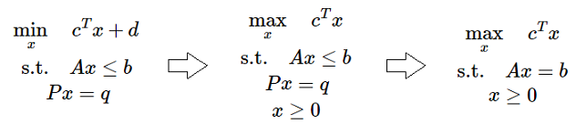
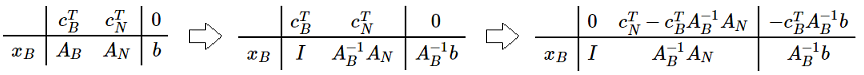
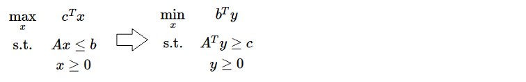
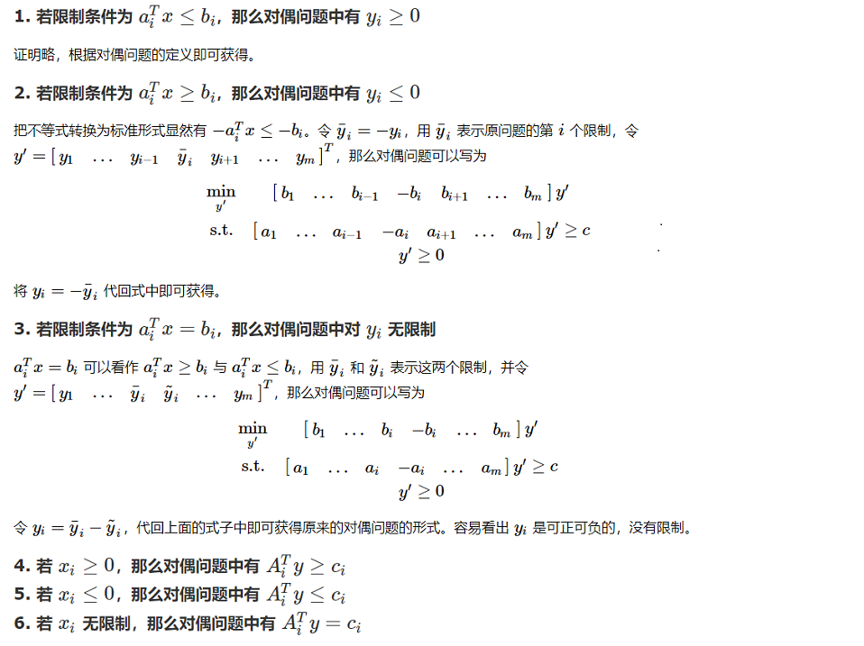
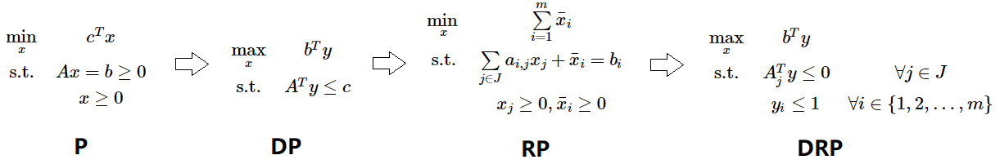
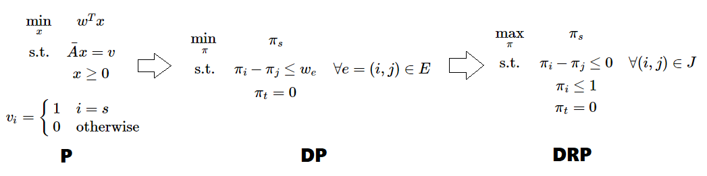
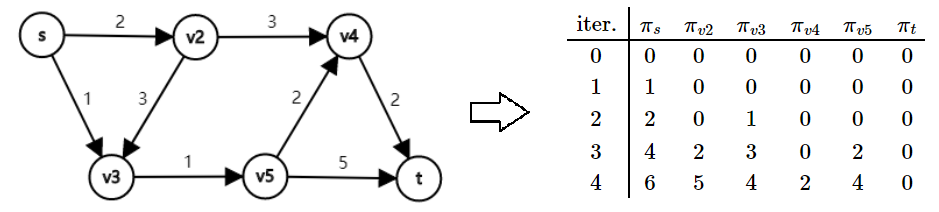
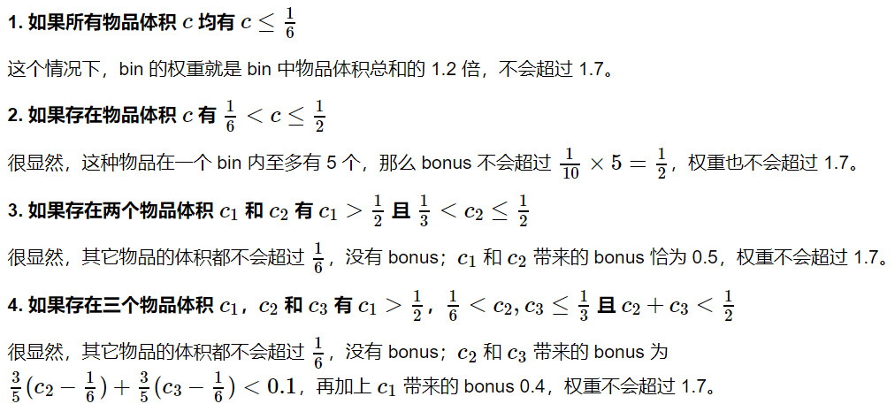
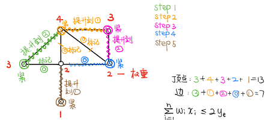
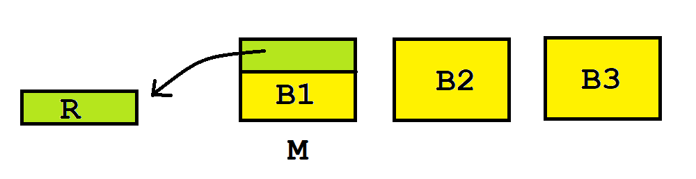

# 线性规划的基本理论

[Google浏览器 MathJax 插件安装](https://chrome.google.com/webstore/detail/tex-all-the-things/cbimabofgmfdkicghcadidpemeenbffn)（渲染本文 Latex 公式）

## 凸集、凸函数、凸优化
+ **凸集**：任取 $x, y \in S$ 和 $\forall \theta \in [0,1]$ 满足 $\theta x + (1-\theta)y \in S$，称集合 $S$ **凸集（Convex Set）**。
    + 凸集的交仍然是凸集。
    + 如果没有 $\forall \theta \in [0,1]$ 的条件，称集合 $S$ **仿射集（Affine set**）。 
+ **凸函数**：对于定义在凸集 $S$ 上的函数 $f(x)$，若对于 $\forall \theta \in [0,1]$ 有 $f(\theta x + (1-\theta) y) \le \theta f(x) + (1-\theta) f(y)$，那么称 $f(x)$ 是**凸函数（Convex Function）**。
	- **延森不等式（Jensen's inequality）**：若 $f(x)$ 是凸函数， $f(\sum_{i=1}^n \theta_ix_i) \le \sum_{i=1}^n \theta_i f(x_i)$
	- 定理：**凸函数的局部最优就是全局最优**。
		1. 假设 $\hat{x}$ 是局部最优点，$x^\ast$ 为全局最优点，则 $f(\hat{x}) > f(x^\ast)$。
		2. 由于 $f(x)$ 为凸函数，那么对于点 $x = \theta \hat{x} + (1-\theta)x^\ast$ 有 $f(x) \le \theta f(\hat{x}) + (1-\theta) f(x^\ast) < f(\hat{x})$。
		3. 取 $\theta = 1 - \frac{\epsilon}{2|\hat{x}-x^\ast|}$，就有 $|x - \hat{x}| = \frac{\epsilon}{2} < \epsilon$，说明 $x$ 在 $\hat{x}$ 的邻域内且比它优，矛盾。
	- 凸函数的判定条件：
		+ 一阶判定条件：设 $f(x)$ 在凸集 $C$ 上一阶可微，则该函数为凸的充要条件是：对于 $\forall x, y \in C$，都满足 $f(y) \ge f(x) + \nabla f(x)^T(y-x)$.
		+ 二阶判定条件：设 $f(x)$ 在凸集 $C$ 上二阶可微，则该函数为凸的充要条件是：对 $\forall x \in C$，都满足 $\nabla^2(x) \succeq 0$。
+ **凸优化**：优化 $\min  f(x) \quad \text{s.t.  } g_{i}(x) \leq 0,i \in [1..m] \quad h_{i}(x)=0, i \in [1..p]$。其中 $f(x),g_i(x)$ 是凸函数，$h_i(x)$ 是仿射函数。
	- 定义拉格朗日函数  $L$：$ \mathbf{R}^{n} \times \mathbf{R}^{m} \times \mathbf{R}^{p} \mapsto \mathbf{R}$, $ L(x, \lambda, v)=f{0}(x)+\sum_{i=1}^{m} \lambda_{i} g_{i}(x)+\sum_{i=1}^{p} v_{i} h_{i}(x)$
	- 最优解 $\pmb{(x,\lambda,v)}$ 满足 **KKT** 条件
	    - 原始条件：$g_i(x) \le 0, h_i(x) =0$
	    - 拉格朗日函数梯度为 $0$：$\nabla_x L = \pmb{0}$
	    - 对偶约束：$\lambda_i \ge 0$
	    - 互补松弛条件：$\lambda_ig_i(x)=0$

## 线性规划的定义
+ 左边形式的问题被称为**线性规划（Linear Programming）**
	
	- 由于仿射函数既是凸函数又是凹函数，所以优化问题是 min 还是 max 问题不大；常数 $d$ 对优化问题的解没有影响，一般也可以去掉。这就变成了中间的这个优化函数。
	- 对于 $Ax \le b$ 这个约束，可以通过添加非负变量将其松弛成等式。所以我们总能将线性规划转成右侧的形式。右式也称为线性规划的**典则形式**。
+ **极点**：若 $x \in S$ 无法表示为凸集 $S$ 内某两个元素的凸组合，称 $x$ 是**极点（extreme point）**。
	- LP 问题的可行域实际上是很多超平面的交，最后组成的应该是一个超多面体。
	- 极点就是超多面体的“顶点”。可以证明，若最优解有解，必然取在极点上：
		1. 假设最优点 $O$ 严格在凸集里面。任取一条与凸集交在 $P$ 和 $Q$ 的直线。因为是线性规划问题，$O$ 点处的函数值一定是 $P$ 点和 $Q$ 点的线性组合。所以 $P$ 和 $Q$ 中，至少有一处的函数值是大于等于 $O$ 的。
		2. 我们可以重复上述步骤，把最优点一步一步约束到顶点上。比如在三维中，我们先将其“规约”到凸壳的表面上，最后“规约”到凸壳的边和点上。
+ **基可行解**：我们讨论 $Ax = b$ 有解且行满秩的情况（如果不满秩就去掉线性相关的限制条件）。设 $A$ 是一个 $m \times n$ 的矩阵，根据线性代数的知识，我们可以从 $A$ 中选出最多 $m$ 列线性无关的列向量，其它列向量都和它们线性相关。我们把这 $m$ 个列向量调整到前面去，把 $A$ 分成两部分：$A = \begin{bmatrix} A_B & A_N \end{bmatrix}$.容易构造出 $Ax = b$ 的一个解：$x = \begin{bmatrix} A_B^{-1}b \quad 0 \end{bmatrix}^T$，称这种解为**基可行解（Basic Feasible Solution）**。显然，基可行解至多有 $C_n^m$ 种。
    - 定理1：**每个极点都对应着一个基可行解，且每个基可行解都对应着一个极点**。
    - 定理2：**最优解一定可以在基可行解处取到**。
+ [tsr 的概念讲解](https://www.cnblogs.com/tsreaper/p/aop1.html)

## 单纯形法
+ **单纯形法（Simplex Method）**（以 $\max$ 模型为例）
    1. 将 $A$ 中的**基变量**消成单位矩阵，并把目标函数**基变量**的系数都消成 $0$。
    2. 以某种策略找一个 $c_j>0$ 的非基变量 $j$ **入基**。
    3. 依次考察 $b_i > 0$ 的行，确定一行 $i$ 使得 $\frac{b_i}{A_{i,j}}$ 最小（对于 $j$ 最紧的限制）。
    4. 拿第 $i$ 行去消，把每一行的 $A_{?,j}$ 以及目标函数的 $c_j$ 都消成 $0$。即第 $i$ 行的基变量**出基**。
    5. 重复步骤 $2 \sim 4$ 直到检验数全大于 $0$.
+ **单纯形表（Simplex Tabuleau）**
	- 变量分成基变量和非基变量：设 $c^T = \begin{bmatrix} c_B^T & c_N^T \end{bmatrix}$， $A = \begin{bmatrix} A_B & A_N \end{bmatrix}$，$x = \begin{bmatrix} x_B^T & x_N^T \end{bmatrix}^T$
	- 显然我们有 $A_Bx_B + A_Nx_N = b$ 且 $z = c_B^Tx_B + c_N^Tx_N$
	- 通过简单的线性变换有：
		
	- 这其实就是单纯形法的形式化迭代过程
+ 评价
	- 变换的本质是：在满足约束的限制下，用不同的**非基变量组合**来表示目标函数。
	- 当非基变量的检验值均 $\le 0$ 时取到最大值。我们可以想象成，目标函数就是由这些非基变量决定的，它们目前都取了 $0$，而且任意变量的微小增长都会导致结果变劣。
	- **单纯形正确性证明**
		1. 设最终的检验数是 $\hat{c}$（均小于 $0$），对应的解是 $x$，最优解是 $y$。
		2. 令 $d=x-y$，我们有 $Ax - Ay = b - b = 0 = Ad = A_Bd_B + A_Nd_N$ 
		3. 那么 $d_B = -A_B^{-1}A_Nd_N$，则 $c^Td = c_B^Td_B + c_N^Td_N = (c_N^T-c_B^TA_B^{-1}A_N)d_N = \hat{c}d_N$
		4. 我们知道 $x_N = 0$，又 $y \ge 0$，所以 $d_N \ge 0$；又 $\hat{c} \le 0$，所以 $c^Td = \hat{c}d_N \le 0$，那么 $c^Ty = c^Tx + c^Td \le c^Tx$，说明 $y$ 并没有比 $x$ 更优。
	- **在非退化情况下，单纯形法一定可以停止**。因为每次迭代都会让答案更优一点，访问的基可行解空间是不会重复的。而基可行解数量又是有限的，所以算法一定可以停止。
	- 可以证明，如果按字典序的顺序选取 $j$，单纯形算法一定可以停止。
+ [tsr 讲解单纯形法](https://www.cnblogs.com/tsreaper/p/aop3.html)

## 单纯形法的初始可行解
+ 初始可行解
	- 若单纯形的约束是 $Ax \leq b$，初始可行解可以取 $x = \pmb{0}$.
	- 若约束是 $Ax = b$ 时，我们可以通过加入松弛变量 $\bar{x}$ 使得 $Ax + \bar{x} = b$，这样 $x = \pmb{0}, \bar{x} = b$ 是初始可行解。这里存在一个问题：$\bar{x}$ 是我们添加进去的变量——我们希望 $\bar{x}$ 能全部出基。
+ **大 M 法（Big M Method）**
	- 对不为 $0$ 的 $\bar{x}$ 进行“惩罚”。将目标函数改为 $z = c^Tx - M\sum_{i=1}^m\bar{x}_i$。如果 $M$ 是一个足够大的正数，$\bar{x}$ 就会在 $-M$ 这个“严厉的惩罚”之下变成 $0$。
	- $M$ 取多大很难说，且取得过大会影响精度。
+ **两阶段法（Two-Phase Method）**
	- 添加了 $\bar{x}$ 后，我们考虑一个新的线性规划：约束不变，改成优化 $\min {\sum \bar{x}_i}$ 这个函数。一组显然的初始可行解是 $x = \pmb{0}, \bar{x} = b$.
	- 如果这个优化问题的最优解的目标函数值不为 $0$，则原问题无可行解；否则我们就找到了原问题的一组可行解。我们再以这个可行解为起点，利用单纯形法求出原问题的最优解即可。
	- 由此可以发现，**线性规划的可行解和最优解求解难度相同**。
+ 思考：对于 $\max c^Tx,Ax \le b$ 这个模型，如果突然多了一个 $x_1 \ge 4$ 的条件怎么办？
	- 添加一个松弛变量 $\overline{x}$： $-x_1+\overline{x} = -4$
	- 此时会发生一个问题：$\overline{x}$ 和 $b$ 至少有一个会取负号，不符合约束。
	- 怎么办呢？再引进一个变量 $\hat{x}$：$x_1-\overline{x}+\hat{x}=4$
	- 至此，$\hat{x}=4$ 是新问题的一个可行解，直接套大M法或二阶段法求解。
+ [tsr 讲解初始可行解](https://www.cnblogs.com/tsreaper/p/aop3.html)

## 对偶定理与对偶单纯形法

+ 线性规划的对偶  
	
	
+ 对偶定理
	- **弱对偶定理 (Weak Duality)：设 $x$ 和 $y$ 分别是原问题和对偶问题的可行解，则 $c^{\rm T}x \le b^{\rm T}y$**。证明：由 $y$ 的可行性我们有 $A^{\rm T}y \ge c$，即 $y^{\rm T}A \ge c^{\rm T}$，两边同乘以 $x$ 有 $y^{\rm T}Ax \ge c^{\rm T}x$；由 $x$ 的可行性还有 $Ax \le b$，那么 $y^{\rm T}Ax \le y^{\rm T}b$，合起来就是 $c^{\rm T}x \le b^{\rm T}y$。
	  - 最优性：若 $x$ 和 $y$ 分别是原问题和对偶问题的可行解，而且 $c^\mathrm{T}x=b^\mathrm{T}y$，那么 $x$ 和 $y$ 分别是原问题和对偶问题的最优解。
	  - 可行性：若原问题无最优解（可以取无穷大），则对偶问题无可行解；若对偶问题无最优解（可以去无穷小），则原问题无可行解。
  - **强对偶定理 (Strong Duality)：若原问题（或对偶问题）有有限最优解，那么对偶问题（或原问题）也有有限最优解，且二者最优解相等**。通过单纯形法的计算过程来辅助证明。
  - **互补松弛定理 (Complementary Slackness)：若 $x^\ast$ 与 $y^\ast$ 分别是原问题和对偶问题的可行解，以下两点等价**：
	1. $x^\ast$ 和 $y^\ast$ 分别是原问题和对偶问题的最优解；
	2. $(y^{\ast {\rm T}}A - c^{\rm T})x^\ast = 0$ 且 $y^{\ast {\rm T}}(Ax^\ast-b) = 0$。
+ 对偶单纯形法步骤（以 $\min$ 模型为例）
	1. 取一组检验数全都 $\ge 0$ 的基。
	2. 找一个 $b_i < 0$ （一般找绝对值最大的）行 $i$，将非基变量 $i$ 出基。
	3. 我们想让某个非基变量从 $0$ 变成大于 $0$ 来增加 $b_i$。在这一行中，找一个 $A_{i,j}< 0$ 的 $j$ 使得 $|\frac{c_j}{A_{i,j}}|$ 最小（这样 $j$ 消完目标函数后检验数依然全都 $\ge 0$），让 $j$ 入基。
	4. 重复步骤 $2 \sim 3$ 直到约束右侧的值均 $\ge 0$ 。
+ [tsr 讲解对偶单纯形](https://www.cnblogs.com/tsreaper/p/aop4.html)

## 原始对偶方法

+ 基本思想：
	- 灵活运用了互补松弛条件 $(y^{\ast {\rm T}}A-c^{\rm T})x^\ast=0$ 且 $y^{\ast {\rm T}}(Ax^\ast-b) = 0$.
	- 给出一组对偶的解，强行去满足互补松弛条件。每次观察 $x$ 是否满足原问题的约束，若不满足就不断地修正 $y$。
	
+ **原始对偶算法** 流程
	
	1. 我们先列出原问题（**P**）的对偶问题（**DP​**），并找到 $y$ 的一组可行解。
	   + 如果 $c \ge 0$，直接取 $y=\pmb{0}$ 即可。
	   + 否则我们给原问题增加一个变量与一条约束 $x_1 + x_2 + \dots + x_n + x_{n+1} = b_{m+1}$，其中 $b_{m+1}$ 需要足够大，至少要大等于 $x_1 + x_2 + \dots + x_n$ 可能的最大值。
	   + 加入新约束后，对偶问题的约束变成了 $A^Ty + y_{m+1}\begin{bmatrix} 1,1,\dots,1 \end{bmatrix}^T \le c$，目标函数变成了 $\max b^Ty + b_{m+1}y_{m+1}, y_{m+1} \le 0$。取可行解 $y_i(i \in [1..m])=0,y_{m+1}=\min c_i$
	2. 现在我们需要寻找一个原问题的可行解 $x$ 满足互补松弛定理。设 $A_j$ 表示矩阵 $A$ 的第 $j$ 列，定义 $J = \{ j | A_j^Ty = c_j \}$。根据原问题的定义和互补松弛定理，我们想要找到符合要求的 $x$ 使得 $x_j = 0,\forall j \not\in J$ 且 $x_j \ge 0,\forall j \in J$ 。
	3. 构造一个带限制的原问题（**RP**）。如果 **RP** 的目标值取 $0$，我们就找到了符合要求的 $x$。
	4. 再构造 **RP** 的对偶问题（**DRP**），设 $\bar{y}$ 是**DRP**的最优解。显然 $\bar{y}=\pmb{0}$ 是一组可行解，若其也是最优解，则当前对偶可行的 $y$ 就是对偶问题的最优解。
	5. 若 $y$ 目前不是最优解，则 $\bar{y}>\pmb{0}$ ，我们想办法用 $\bar{y}$ 改进 $y$：设 $\hat{y} = y + \theta\bar{y}$（其中 $\theta \ge 0$）。注意到，$\hat{y}$ 仍然需要是对偶可行的，即 $A^T\hat{y} = A^Ty + \theta A^T\hat{y} \le c$ 仍要满足。
	6. 考虑 $\theta$ 的取值范围。对于 $j \in J$，因为 $A^T_j\bar{y} \le 0$，无论 $\theta$ 取多大，都不会超过 $c$ 的限制，所以这些项不会限制 $\theta$ 的取值；对于 $j \not\in J$，我们选择 $\theta = \min_{j \not\in J, A^T_j\bar{y} > 0} \frac{c_j - A^T_jy}{A^T_j\bar{y}}$ 。这样就能让 $j \not\in J$ 中的一条限制变紧，且其它限制则不会超过。
	7. 将 $y$ 调整为 $\hat{y}$ 之后，进入下一轮迭代调整，直到 **DRP** 的最优解让目标函数值为 0
	
+ 经典例子：最短路问题
	
	1. 我们用图的点 - 弧关联矩阵表示 $s$ 到 $t$ 的线性规划问题。因为矩阵 $A$ 是全幺模矩阵，解出的实数最优解必然是整数解。下面我们尝试用原始对偶方法解这个线性规划。
	2.  $A$ 矩阵显然是线性相关的（把 $A$ 的每一行加起来得到零向量）不妨从 $A$ 中去掉代表终点 $t$ 的那一行，得到新矩阵 $\bar A$。即新的线性规划是原问题（**P**）。
	3. 我们写出对偶问题（**DP**）（它其实就是差分约束系统）和带限制的对偶问题（**DRP**）。
	4. 这个 **DRP** 非常得清晰。如果想要让 $\pi_s$ 取成 $0$，必须保证 $t$ 也在和 $s$ 相关的连通块（右$\pi_i-\pi_j=w_e$ 的 $e$ 组成的连通块）里。所以我们不断更新 $\pi$ ，每次把 $J$ 里的点的 $\pi_i$ 集体提升到尽可能的大。每次提升 $J$ 里的元素单调增加，复杂度为 $O(NM)$。
	   
	
+  对偶问题 **DP** 优化的函数值就是最短路的直接证明（作业题）
  1. 找到 $s$ 到 $t$ 的任意一条最短路。向量 $\pmb{f}$ 满足：$\pmb{f}_i$ 是这条最短路从 $s$ 到 $i$ 经过的边的权值和，同时记 $F=\pmb{f}_t$.
  2. 设向量 $\pmb{g}$ 是该对偶问题取到最大值时的一组解，记 $G$ 为最大值。
  3. 因为 $\pmb{f}$ 表示一条最短路，由最短路性质，我们发现 $\pmb{f}$ 是满足上述线性规划限制的一组可行解。由 $\pmb{g}$ 是一组最优解，所以 $F \le G$.
  4. 现在只需证明 $F \ge G$ 即可说明 $F=G$。反证，假设 $F < G$.
  5. 由 $\pmb{f}_s \ge \pmb{g}_s=0,\pmb{f}_t < \pmb{g}_t$，$\pmb{f}$ 表示的最短路径上必然存在一条边 $e=(u \rightarrow v,w)$，满足 $\pmb{f}_u \ge \pmb{g}_u,~\pmb{f}_v < \pmb{g}_v$. 所以 $\pmb{f}_v-\pmb{f}_u < \pmb{g}_v - \pmb{g}_u$. 因为 $\pmb{f}$ 表示最短路径，所以 $\pmb{f}_v-\pmb{f}_u=w$，即 $\pmb{g}_v-\pmb{g}_u>w$，这和 $\pmb{g}$ 是该线性规划的一组可行解矛盾。所以假设不成立，即 $F \ge G$。
  6. 最终我们得到 $F=G$，原命题得证。

+ [tsr 讲解原始对偶方法](https://www.cnblogs.com/tsreaper/p/aop5.html)

## 整数线性规划
+ TSP 问题
	- 考虑如何用线性规划表示
		+ $\min{\sum \limits_{e=(i,j)} c_{i,j}x_{i,j}}$
		+ 其中 $x_{i,j} \in \{0,1\}$，$x_{i,j}=1$ 当且仅当 $(i,j)$ 是环上的相邻两点。
	- 尝试更形式化地表达
		+ 构成环的必要条件：$\forall i\sum \limits_{j=1}^n x_{i,j}=1$ 且 $\forall j \sum \limits_{i=1}^n x_{i,j}=1$。
		+ 若只有这两个限制，会导致**多个不相交圈**的情况：要强制让所有点都与 $1$ 号点同圈。
		+ 因此，新增 $u1,\dots,u_n$ 这 $n$ 个辅助变量并加一个新约束：$u_i - u_j + n x_{i,j} \le n-1$，其中 $1 \le i \le n, 2 \le j \le n, i \ne j$.
	- 证明以上约束的正确性
		+ 对于一个多圈的解，必然存在一个圈不包含 $1$。沿圈上走一圈，上述限制 $x_{i,j}$ 都会取 $1$。将这些不等式全部加起来，会得到 $kn \le k(n-1)$（$k$ 是圈的长度），产生矛盾。说明必然有约束不能满足。
		+ 对于一个单圈的解，一种 $u_i$ 的可行取法是：$u_1=0,u_{p_2}=1,u_{p_3}=2,\dots,u_{p_{n-1}}=n-1$，其中 $p_i$ 表示TSP问题里从 $1$ 出发顺次访问到的第 $i$ 个点。对比上一条，约束能满足的原因是：$j$ 是从 $2$ 开始取的，$u_{p_{n-1}}$ 到 $u_1=1$ 是没有限制的。
		+ 对于不在圈上的边，$x_{i,j}=0$，即 $u_i-u_j \le n-1$。审视上一条，最大的 $u_i$ 也是 $n-1$，所以可行。
		+ $u_i$ 就像是每个点在环上的“势”，可以集体地增减。我认为只要限制 $u_i \ge 0$ 就能正确地求出一组解（无需 $u_i$ 是整数的限制，因为也可以 $u_i$ 全体是实数）。如果加一条适当的限制（如 $\sum u_i = \frac{n\times(n-1)}{2}$），跑出来的最优解必然是整数。
+ 01 背包
	- 线性规划模型
		+ $\max \limits \sum_{i=1}^{n} v_{i} x_{i}$
		+ $\text { s.t. } x_{i} \in\{0,1\},\sum_{i=1}^{n} w_{i} x_{i} \leq C$
	- 贪心解及其近似度分析
		+ 朴素贪心做法：将物品按 $\frac{v_i}{w_i}$ 从大到小排序，依次塞入背包直到装不下。
		+ 该算法近似比是**无穷大**，分析如下：
			- 我们求上述线性规划的实数解，记为 $\mathrm{LP(I)}$。
			- 观察 $\mathrm{LP(I)}$ 解的结构：性价比前 $m$ 大的物品一定是完整地取走，剩下的某**一个**物品取了“分数”个（可以用调整法证明）。不妨设前 $m$ 个物品的总价值是 $\alpha$，剩下取的那个物品价值是 $\beta$，我们可以得到 $\mathrm{OPT(I) \le LP(I) \le \alpha + \beta, Greedy(I) \ge \alpha}$
			- 基于以上分析，贪心解近似比 $=\mathrm{\frac{OPT(I)}{Greedy(I)}} \le \frac{\alpha+\beta}{\alpha} = 1 + \frac{\beta}{\alpha}$
			- 若前 $m$ 个物品体积和是 $2 \epsilon$、单位价值是 $v_0$，剩下选的物品是 $C-\epsilon$、$\frac{v_0}{2}$，则 $\frac{\beta}{\alpha} = \frac{C-\epsilon}{4\epsilon} \rightarrow +\infty$
		+ **Trick**：我们修改一下上述贪心做法：当 $\alpha < \beta$ 时我们只取后者。这样 $\mathrm{Greedy(I) \ge \max(\alpha, \beta)}$，近似比为 $=\mathrm{\frac{OPT(I)}{Greedy(I)}} \le \frac{\max(\alpha, \beta)}{\alpha} \le 2$，即近似比为 $2$.
	- 近似做法
		+ 朴素反向背包算法：设 $f_{j,i}$ 表示前 $j$ 个物品中，选的价值总和恰好是 $i$，最少需要的空间。直接做的复杂度是 $O(n^2V_{max})$，能得到最优解。
		+ 现在对价值进行 Scaling：把每个物品的价值调整成 $\lfloor \frac{V_i}{k} \rfloor$后再DP，$k$ 是某个常数。
	- 下面证明：该 Scaling 做法是**完全多项式算法**。
		+ 完全多项式算法：既是读入规模的多项式，也是近似比$\epsilon$ 的多项式。
		+ 设原问题最优集合是 $S$，答案是 $O$；小规模问题最优集合是 $S'$，答案是 $O'$.
		+ $O'=\sum \limits_{j \in S'} V_{j}^{'} \ge k \sum \limits_{j \in S'}V_j \ge \sum \limits_{j \in S} (\frac{V_j}{k}-1) \ge O-nk$
		+ 令 $k = \frac{\epsilon}{n}V_{max}$，则 $O' \ge (1-\epsilon) O$，且复杂度是 $O(\frac{n^3}{\epsilon})$
+ 匹配问题
	- 设图的点集为 $V$，边集为 $E$， $(i, j) \in E$ 表示从第 $i$ 个点连到第 $j$ 个点的一条有向边，$x_{i, j}$ 表示这条边是否为匹配边。那么一般无向图的最大匹配问题可以写成：
		+ $\max \sum\limits_{(i, j) \in E} x_{i, j}$
		+ $\text{s.t.} \quad \sum\limits_{(i, j) \in E} x_{i, j} \le 1 \quad  \forall i \in V$ 且 $\sum\limits_{(i, j) \in E} x_{i, j} \le 1 \quad \forall j \in V$
		+ 其中 $x_{i, j} \in \{0, 1\}$。
	- 我们也可以用图的点 - 边关联矩阵来描述匹配问题。设图中有 $n$ 个顶点，$m$ 条边，那么图的点 - 边关联矩阵是一个 $n \times m$ 的矩阵。该矩阵每列对应一条边，每行对应一个顶点。若第 $i$ 个顶点是第 $j$ 条边的端点，那么矩阵第 $i$ 行第 $j$ 列为 1，否则为 0（可以看出，这个矩阵描绘的是无向边）。这样，一般无向图的最大匹配问题写为：
		+ $\max\limits_{(i, j) \in E} \sum x_{i, j}$
		+ $\text{s.t.} \quad Ax \le b$，其中 $x_{i, j} \in \{0, 1\}$.
	-  注意，**用线性规划求解二分图的最大匹配问题，最优解的 $x_i$ 取值非 0 即 1**。因为可以证明（数学归纳法），二分图的点-边关联矩阵是**全幺模矩阵**。
	-  二分图最大匹配的对偶问题是**二分图的最小点覆盖**。
+ **Gomory 割平面法**
	- 基本思想：不断增加限制平面，直到某一次求得的最优解为整数。
	- 若我们用单纯形法求解后获得的不全是整数解，选择一个**非整数的变量 $x_i$**，其必然满足：
		$x_i + \sum\limits_{j=m+1}^n \bar{a_{i,j}}x_j = \bar{b_i} \quad \text{①}$ 
  - 既然 $x_i$ 不是整数且 $x_{m+1 \sim n} = \pmb{0}$，说明 $\bar{b_i}$ 一定不是整数，则加入以下限制不会影响原来的整数解空间：
		$x_i + \sum\limits_{j=m+1}^n \left\lfloor \bar{a_{i,j}} \right\rfloor x_j \le \left\lfloor\bar{b_i}\right\rfloor \quad \text{②}$
	- 现在我们就多了②这个限制，把它加进约束里进一步求解即可。一般我们会加入①-②，这样限制更简单些：
		$\sum\limits_{j=m+1}^n(\bar{a_{i,j}} - \left\lfloor \bar{a_{i,j}} \right\rfloor) x_j \ge \bar{b_i} - \left\lfloor \bar{b_i} \right\rfloor \quad \text{①}-\text{②}$
- **分枝定界法**
	- 分枝定界法的思想和最优性剪枝或者 min-max 搜索树类似。
	- 我们先解实数线性规划，得到了整数规划最优解的**上界**。假设最优解中 $x_i(k < x_i < k+1)$ 不是整数，就会有两种可能：$x_i \le k$ 或 $x_i \ge k+1$，对两种情况分别进行搜索。
	- 如果在某一枝内算出了一个整数解，我们就得到了原整数规划最优解的**下界**。
	- 某个搜索分支结束有三种可能：
		+ 当前线性规划无可行解（*死枝*）。
		+ 当前（实数）最优解未超过下界（*枯枝*）。
		+ 当前已经是整数解（*活枝*）。
- [tsr 讲解割平面法和分枝定界法](https://www.cnblogs.com/tsreaper/p/aop6.html)

## 独立系统

+ 对于一个二元组 $(E,\mathcal{F})$，若 $\forall Y \in \mathcal{F}$，$X \subseteq Y \to X \in \mathcal{F}$，那么我们称 $(E,\mathcal{F})$ 为**独立系统**。由这个定义我们马上推出，$\emptyset \in \mathcal{F}$。
	- 在独立系统 $(E,\mathcal{F})$ 中，$\mathcal{F}$ 中的元素称为**独立集**，$2^E−\mathcal{F}$ 中的元素称为相关集。
	- 将 $\mathcal{F}$ 中的极大独立集称为**基**，将 $E - \mathcal{F}$ 中的极小相关集称为**圈**。
	- 对于 $X \subseteq E$，定义 $X$ 上的基为 **$X$ 上的极大独立集**。
	- 独立系统的**秩商** $q(E, \mathcal{F}) = \min\limits_{x \subseteq E} \quad \frac{\rho(X)}{r(X)}$
	- **最大化问题**：找到 $F \subseteq \mathcal{F}$ 使得 $c(F)$ 最大（$F$ 必然是基）。
	- **最小化问题**：找到 $c(F)$ 最小的基。
		+ 最小生成树：$E$ 中元素是边，$\mathcal{F}$ 中元素是所有不含圈的边集，费用是每条边的权值。
		+ 最短路：$E$ 中元素是边，$\mathcal{F}$ 中元素是起点到终点的简单路径及其子集，费用边权。
		+ 旅行商问题：$E$ 中元素是边，$\mathcal{F}$ 中元素是哈密尔顿回路及其子集，费用是边权。
	- 独立系统的**交**：两个独立集系统 $(E,\mathcal F_1)$ 和 $(E, \mathcal F_2)$ 的交为 $(E, \mathcal F_1 \cup \mathcal F_2)$.
	- 独立系统的**对偶**：设 $\mathcal{F}^* = \{F \subseteq E ~|~ \exists (E, \mathcal{F}) \text{ 的基 } B, F \cap B = \emptyset\}$。显然 $(E, \mathcal{F}^*)$也是独立系统，我们称 $(E, \mathcal{F})$ 与 $(E, \mathcal{F}^*)$ 互为对偶。
- **拟阵**：基的大小都相等的独立系统。
	
+ 常见的独立系统
	- 0-1 背包问题：$E$ 中元素是物品，$\mathcal{F}$ 中元素是可以放进背包的物品集合，费用是物品价值。
	- 最长简单路径：$E$ 中元素是边，$\mathcal{F}$ 中元素是起点到终点的简单路径及其子集，费用是边权。
	- 最大权独立集：$E$ 中元素是点，$\mathcal{F}$ 中元素是独立集，费用是点权。
	- 最大权森林：$E$ 中元素是边，$\mathcal{F}$ 中元素是所有不含圈的边集，费用是边权。

+ 两类贪心算法
    - **Best in 算法** （解决最大化问题）：将 $E$ 中所有元素按费用从大到小排序，使得 $c(e_1) \ge c(e_2) \ge ... \ge c(e_n)$。一开始令 $F = \emptyset$，按 $e_1, e_2 \dots, e_n$ 的顺序考虑，若 $e_i$ 加入 $F$ 后 $F$ 仍是独立集那就加入。
	- **Worst out 算法**（解决最小化问题）：将 $E$ 中所有元素按费用从大到小排序，使得 $c(e_1) \ge c(e_2) \ge ... \ge c(e_n)$。一开始令 $F = E$，按 $e_1, e_2 \dots, e_n$ 的顺序考虑，若把 $e_i$ 从 $F$ 中去掉后 $F$ 还含有至少一个基那就去掉。
	- **Best in 定理**：设 $G(E, \mathcal{F})$ 表示 Best in 贪心得到的解，$\text{OPT}(E, \mathcal{F})$ 表示最优解，则 $$q(E, \mathcal{F}) \le \frac{G(E, \mathcal{F})}{\text{OPT}(E, \mathcal{F})} \le 1$$ 。从这个定理可以看出，如果一个独立系统是拟阵，那么用 best in 得到的最大化问题的解一定是最优解。
		+ 证明：首先定义 $E_j = \{e_1, e_2, \dots, e_n\}$，$G_n$ 是 best in 贪心选中元素的集合，$O_n$ 是最优解选中元素的集合。令 $G_j = E_j \cap G_n$ 表示 best in 贪心在考虑 $e_j$ 之后选择了哪些元素，$O_j = E_j \cap O_n$ 表示最优解在考虑 $e_j$ 之后选择了哪些元素。记 $d_j = c(e_j) - c(e_{j+1})$ 以及 $d_n = c(e_n)$，那么：
		$$\begin{matrix} c(G_n) & = & \sum\limits_{j=1}^n(|G_j| - |G_{j-1}|)c(e_j) \\ & = & \sum\limits_{j=1}^n|G_j|d_j \\ & \ge & \sum_{j=1}^n \rho(E_j)d_j & \text{（因为容易证明 } G_j \text{ 是 } E_j \text{ 的一个极大独立集）} \\ & \ge & q(E, \mathcal{F})\sum\limits_{j=1}^n r(E_j)d_j & \text{（根据秩商的定义）} \\ & \ge & q(E, \mathcal{F})\sum\limits_{j=1}^n |O_j|d_j \\ & = & q(E, \mathcal{F})c(O_n) \end{matrix}$$。
		+ 可以举一个例子说明 Best in 定理的下界是紧的：根据秩商的定义，$\exists X \subset E$，$X$ 的基 $B_1$ 和 $B_2$ 满足 $\frac{|B_1|}{|B_2|} = q(E, \mathcal{F})$。我们定义 $$c(e) = \begin{cases} 1 & e \in X \\ 0 & e \not\in X \end{cases}$$ 然后把 $B_1$ 中的元素排在前面形成 $e_1, e_2, \dots, e_{|B_1|}$，后面随便排。如果使用 best in 贪心，就会把前面 $|B_1|$ 个元素选走，然而最优解可以选 $|B_2|$ 个元素。

+ 定理：任何一个独立集系统 $(E, \mathcal F)$ 都是有限个拟阵的交。
	- 不妨设其有 $k$ 个圈 $C_1, C_2, \dots, C_k$。
	- 定义 ${\mathcal F_i}= \{ x \subseteq E | x \nsupseteq C_ i\}$
	- $\forall F \subseteq E$，有两种可能：
		1. $F \nsupseteq C_i$
		2. $F \supseteq C_i$，则 $\forall e \in C_i, F \backslash \{e\}$ 是独立集。
	- 得 $\mathcal F_i$ 是拟阵。
	- 断言：${\mathcal F} = \bigcap \limits_{i=1}^k {\mathcal F_i}$。
+ 定理：**若独立集系统 $(E,\mathcal F)$ 是 $k$ 个拟阵的交，则贪心解的近似比至少是 $\frac{1}{k}$**。
	- 考虑 $(E,\mathcal F)$ 的两个不同的最大独立集 $A$ 和 $B$ 且 $|B| \geq |A|$。欲证明：$|B| \leq k|A|$。
	- $\forall e \in B \backslash A$，我们有 $e \notin \bigcap \limits_{i=1}^k (A_i \backslash A)$。其中 $A_i$ 是在 $(E, \mathcal F_i)$ 上含 $A$ 的极大独立集。
		+ 反证，若 $e \in \bigcap \limits_{i=1}^k A_i \backslash A$，则 $\forall i, e \in A_i \backslash A$，得 $A \cup \{e\} \in \mathcal F_i$，与 $A$ 是极大独立集矛盾。
	- 进一步推出， $e$ 最多出现在 $k-1$ 个 $A_i \backslash A$ 中，且 $\sum \limits_{i=1}^k (A_i \backslash A) \leq (k-1)|B \backslash A| \leq (k-1)|B|$
	- 同理，$k|B| \leq \sum \limits_{i=1}^k |B_i| = \sum \limits_{i=1}^k |A_i| \leq k|A|+(k-1)|B|$
	- 即 $|B| \leq k|A|$
+ 拟阵的对偶也是拟阵。
+ 应用在二分图匹配上
	- 二分图 $G=(A \cup B,E)$
	- 构造拟阵1：${\mathcal F_1}= \{ X \subseteq E ~ | ~ |\delta_u| \leq 1, \forall u \in A \}$
	- 构造拟阵2：${\mathcal F_2}= \{ X \subseteq E ~ | ~ |\delta_v| \leq 1, \forall v \in B \}$
	- 则该系统 $(E,{\mathcal F1} \cap {\mathcal F_2})$ 表示了二分图的匹配问题。
+ [tsr 讲独立系统](https://www.cnblogs.com/tsreaper/p/aop7.html)

## Bin Packing 问题

+ [lzw 的 bin packing 问题总结](http://zhenweiliu.gitee.io/blog/2019/07/28/Approximation-Algorithm-3-The%20Binpacking%20Problem/)
+ [$\mathrm{FF(I) \le 1.7OPT(I)+0.8}$ 的证明](https://www.cnblogs.com/tsreaper/p/aop9.html)
  - 设第 $i$ 件物品体积为 $a_i$，定义**权重** $w(a_i)$ 为：$w(a_i) = \frac{6}{5}a_i + v(a_i)$
    $$v(a_i) = \begin{cases} 0 & a_i \le \frac{1}{6} \\ \frac{3}{5}(a_i - \frac{1}{6}) & \frac{1}{6} < a_i \le \frac{1}{3} \\ \frac{1}{10} & \frac{1}{3} < a_i \le \frac{1}{2} \\ \frac{2}{5} & a_i > \frac{1}{2} \end{cases}$$
  - 记 $B$ 为 first fit 算法得到的方案，$B^*$ 为最优方案，$c(B_j)$ 表示第 $j$ 个 bin 中物品的体积总和，$w(B_j)$ 表示第 $j$ 个 bin 中物品的权重总和。
  - 基本想法：如果能证明 $w(B^*_j) \le 1.7$ 且 $w(B_j) \ge 1$，即得 $\text{FF}(I) \le 1.7\text{OPT}(I)$。
  - **Step1 ：证明除两个 bin 以外，其它 bin 权重均值至少为 1**
    - 考虑那些权重不足  $1$ 的 bin。它们有以下性质：
      1. 不含体积至少为 0.5 的物品；
      2. 一个 bin 内不会包含两个体积至少为 1/3 的物品；
      3. bin 的体积之和小于 5/6。
    - 据此容易推出：
      1. 除了最后一个 bin，其它 bin 中至少有两个物品；
      2. 除了最后两个 bin，其它 bin 的体积之和都大于 2/3。
    - 引理：如果两个 bin $B_1$ 和 $B_2$ 满足 $B_1$ 在 $B_2$ 前面、$w(B_1), w(B_2) < 1$、$c(B_1) \ge \frac{2}{3}$ 以及 $B_2$ 有至少两个物品，则 $\frac{6}{5}c(B_1) + v(B_2) \ge 1$。
    - 假设 **FF** 得到的方案中，权重之和小于 $1$ 的 bin 按先后顺序为 $B_1, B_2, \dots, B_k$，那么 $\sum w(B_i) =  v(B_1) + (\frac{6}{5}c(B_1) + v(B_2)) + \dots + (\frac{6}{5}c(B_{k-1}) + \frac{6}{5}c(B_k)) + v(B_k)$ . 这个值显然是  $\ge (k-2) + \frac{6}{5}$的，命题得证。
  - **Step2 ：证明对于任意解 O ，满足 $w(O_i) \le 1.7$**
    
  - 事实上 $0.8$ 的尾巴可以拿掉（即 $\mathrm{FF(I) \le 1.7OPT(I)}$），且 $1.7$ 是最优近似比。
+ FFD 算法
	- 流程：先将物品按体积从大到小排序再套用 FF 做法。
	- FFD 的渐进比值是 $\frac{11}{9}$。一组卡满的例子：$\{ 6 \times (\frac{1}{2}+\epsilon), 6 \times (\frac{1}{4}+2\epsilon), 6 \times (\frac{1}{4}+\epsilon), 12 \times (\frac{1}{4}-2\epsilon) \}$。
	- 该比值下的最优尾项是 $\mathrm{FFD(I)} \le \frac{11}{9} + \frac{6}{9}$，证明很复杂。
	- FFD 的绝对近似比满足：$\mathrm{FFD(I) \le \frac{3}{2} OPT(I)}$。一组卡满的例子：$[\frac{1}{2},\frac{1}{4},\frac{1}{4}],[\frac{1}{3},\frac{1}{3},\frac{1}{3}]$
	- 有趣的拓展：判定一堆物品是否可以塞在两个箱子里。已知 **FFD 是该问题最优的绝对近似比算法**（即不存在任何一个近似算法的绝对近似比 $< \frac{3}{2}$）。
+ 绝对近似比的研究
	- 装箱问题的渐进近似比是 $\frac{11}{9}$，已经不能被改进了。
	- 拓展一下，设算法 $A$ 的近似比是 $A(I) \le \alpha \mathrm{OPT(I)} + \beta$ 这个形式（即允许尾项）。
		+ 可以做到 $A(I) \le (1+\epsilon)\mathrm{OPT(I)} + 1$（证明见下）
		+ [$A(I) \le \mathrm{OPT(I)} + O((\log \mathrm{OPT})^2)$ 的证明戳这里](https://www.cnblogs.com/tsreaper/p/aop10.html)。
		+ 若取 $\alpha = 1$，目前最优的结果是 $A(I) \le \mathrm{OPT(I)} + O(\log {\mathrm{OPT}})$
+ 近似比为 $(1+\epsilon)\mathrm{OPT(I)} + 1$ 的算法介绍
	- 首先，如果物品的种类数是常数个，我们能直接多项式求解。比如，假设一共有 $k$ 种物品，我们用 $(b_1,b_2, \dots, b_k)$ 去表示每一种的个数。那么，任何一个箱子可以装的方案数是一个常数，不妨记为 $M$。
	- 装箱问题可以转化成以下的整数规划问题：求解 $\min \sum \limits_{j=i}^M x_j$，使得 $\sum \limits_{j=1}^M t_{j,i}x_j \ge b_i, x_j \in \mathbb{N^+}$
	- 下面，**我们将考虑所有 $> \epsilon$ 的物品**(每个箱子里最多装 $\lfloor \frac{1}{\epsilon} \rfloor$ 个)。
		+ 对于一个实例 $I$，将物品体积从小到大排序，每隔 $\frac{1}{\epsilon^2}$ 个划成一组，最后会分成 $\frac{1}{\epsilon^2}$ 组。
		+ 构造实例 $J_1$，将每个物品的体积放大至与下一组的分界点。于是 $\mathrm{OPT(J_1)}$ 是多项式可解的，而且 $J_1$ 是原问题的一组可行方案。
		+ 构造实例 $J_2$，将每个物品的体积缩小至与上一组的分界点。我们有 $\mathrm{OPT(J_2) \le OPT(I) \le OPT(J_1)}$。
		+ 容易发现，因为每组的大小相等，$J_1$ 和 $J_2$ 的前后两组的个数是一样的，可以得到 $\mathrm{OPT(J_1)}$ 最多比 $\mathrm{OPT(J_2)}$ 多 $\theta = n\epsilon^2$ 个箱子（这里忽略了一些常数上的细节）
		+ 因为 $\mathrm{OPT(I) \ge n\epsilon}$，所以 $\mathrm{\theta \leq n \epsilon^2 \leq \epsilon OPT(I)}$
	- 再反过来，考虑所有 $\leq \epsilon$ 的物品。如果全能塞进之前的箱子，那就证毕了。否则除最后一个箱子外，每个箱子的空隙必然 $< \epsilon$，即 $\mathrm{J_1(I) \le \frac{1}{1-\epsilon}OPT(I)+1 \le (1+\epsilon)OPT(I)+1}$
+ 作业题：设计一个绝对近似比是 $1.5$ 的线性装箱算法
	- 将所有 $> \frac{1}{2}$ 的物品单独装箱。
	- 依次枚举每个箱子，不断塞入 $< \frac{1}{2}$ 的物品。**每当放不下的时候，把该物品切成两部分：一部分装满这个箱子，另一部分装到下一个箱子里。**（如果用完了所有箱子就新开箱子）。
	- 设总共用了 $K$ 个箱子（显然 $K \le \mathrm{OPT}$，因为现在是密密地叠着的）。注意现在不一定是可行解。**被切开的物品最多只有 $K-1$ 个，而且都是 $< \frac{1}{2}$ 的**。我们把它们从箱子中抽出来，两两组合装箱，用到了 $\lceil \frac{K-1}{2} \rceil$ 个箱子。
	- $K+\lceil \frac{K-1}{2} \rceil \le 1.5K \le \mathrm{OPT}$

## Job Scheduling with Equal Length

+ 问题描述
	- 你有若干个机器可以并行处理任务。
	- 某个时刻会来一个新的任务，如果你选择做，你可以在任意时刻将它分配给任意机器。
	- **每个任务所需时间都是相等的**，且有一个截止时间。
	- 任务的给出分为在线和离线两种，在这里我们讨论在线。

+ 贪心算法
	- 假设**只有一台机器**，而且策略是“能做就做”。
	- 我们将用 **Charge Scheme** 的技术证明：该算法近似比是 $2$。
	- 对于贪心解 $S$ 里完成的每个任务 $i$，设一个势 $\phi_i$。
	- 对于最优解 $S^*$ 里完成的每个任务 $i$，考察它开始执行的时刻：
		+ 若此时贪心解里正在执行任务 $k$，则 $\phi_k \leftarrow \phi_k + 1$。
		+ 若此时机位是空闲的，说明贪心解在之前已经做过了任务 $i$（否则为啥不放到现在来做）。则 $\phi_i \leftarrow \phi_i + 1$。
	- 注意到，贪心解里的每个任务最多被索引两次（它自己，它启动时刻最优解里的任务），即 $\phi_i \le 2$。
	- 由 $\sum \limits_{i \in S} \phi_i = |S^{\ast}|$ 和 $\phi_i \le 2$ 可得：$|S| \ge \frac{1}{2}|S^{\ast}|$
+ Best Fit 算法
	- 算法描述：每当一个任务进来的时候，将它丢给**能安排它的机器中**（使其不超过deadline）空闲时刻尽量靠后的。
	- 下面证明，**只有两台机器时**，该算法近似度至多是 $\frac{9}{5}$。
	- 对于最优解里的每个任务 $i$，考察它开始执行的时间：
		+ 若此时两台机器都空闲着，$\phi_(i) \leftarrow \phi_{i}+1$。
		+ 若此时有一台机器在执行任务 $u$，则 $\phi_u \leftarrow \phi_u + \frac{2}{5}, \phi_i \leftarrow \phi_i + \frac{3}{5}$。
		+ 若此时两台机器都在执行任务（早开始的执行任务 $u$，迟开始的执行任务 $v$），则 $\phi_u \leftarrow \phi_u + \frac{2}{5}, \phi_v \leftarrow \phi_v + \frac{3}{5}$
	- 现在考虑贪心解里的每一个任务 $i$
		+ 最多被三个最优解里的任务引用
		+ 如果没有被加过 $1$，则 $\phi(i) \le \frac{3}{5} \cdot 3$
		+ 否则，它在开始做的时候一定没有别的机器，即它一定是任务 $u$，$\phi(i) \le 1 + \frac{2}{5} \cdot 2$
	- **有 $k$ 个机器的时候**，可以设 $x_1 \dots, x_k$ 这 $k$ 个变量来求解最优近似比。

## TSP 问题和哈密顿回路
+ 简化条件
	- 如果是普通完全图，TSP问题不存在常数比的近似算法。
	- 额外加一个约束：边权必须满足三角不等式。
+ 一个近似比为 $2$ 的做法
	1. 对原图求一遍 MST。
	2. 把 MST 的每条边倍增，转成一个欧拉图。
	3. TSP回路的点序列即为欧拉图的遍历序列（有重复点就跳过）。
	- 由 $\text{MST} < \text{OPT}, \text{TSP} \le \text{Euler}, \text{Euler} = 2\text{MST}$，得该算法近似比是 $2$。
+ 简单的改进
	1. 求完 MST 后，我们把奇数度数的点取出来（一定是偶数个）。
	2. 对这些点的诱导子图做一次边的完美匹配，两两连接匹配上的两点。
	3. 这样所有点的度数都是偶数了，套用之前的做法。
	- 因为 $\text{MATCH} \le \frac{1}{2}\text{OPT}$，所以该算法近似比是 $1.5$。
+ [拓展：哈密顿路](https://www.cnblogs.com/tsreaper/p/aop11.html)

## 基于线性规划的近似算法
+ 带权点覆盖问题的LP解法
    - 设 $x_i$ 表示第 $i$ 个点是否选，我们可以列出一个整数线性规划问题；每条边 $(u,v)$ 即为一个限制 $x_u+x_v \ge 1$，目标函数即为 $W=\sum v_i x_i$.
    - 将这个线性规划一般化: $0 \le x_i \le 1$。这样能在多项式内求出一个最优解 $W^*$，其优于原来的最优解。
    - 现在我们把 $W^*$ 对应的 $\pmb{x}$ 做这样的改动：$x'_i=[x_i]$（四舍五入）。
	- 显然，$\pmb{x'}$ 也是符合该线性规划的一组解（对于任意一组限制，至少存在一个 $x_i \ge 0.5$；这时候对应的 $x'_i$ 取成 $1$，满足限制要求）
	- 然后，每一个取 $1$ 的 $x'_i$ 增幅最多只有 $0.5$，即新的 $W'$ 满足 $W' \le 2W^\ast$。
    - 所以该做法的近似度是 $2$。
+ 带权点覆盖问题的对偶解法
	- 接下来这种 2-近似做法只需用到原始对偶的思想，可以避开线性规划求解。
	- 原问题的对偶问题是：求 $\max \limits_{e \in E} y_e$，使得对于所有的 $i \in V$，$\sum \limits_{i \in e} y_e \ge w_i$ 且 $y_e \ge 0$.
	- 列出互补松弛条件
		+ PCS: $x_i(\sum \limits_{e \in E} y_e-w_e)=0$
		+ DCS: $y_e(x_i+x_j-1)=0$ 其中 $e=(i,j)$
	- 在整数线性规划上考虑一个**弱化后的互补松弛条件**：
		+ PCS**成立**：$x_i = 0$ 或 $x_i \ne 0$ 且 $w_i = \sum \limits_{i \in e} y_e$
		+ DCS**不太差**：$y_e = 0$ 或 $y_e \ne 0$ 且 $1 \le x_i + x_j \le 2$
	- 首先我们证明：若该条件成立，近似比为 $2$（$x^{\ast}$ 表示原问题的最优解）。
		+ $\sum \limits_{i=1}^n (\sum \limits_{i \in e} y_e)x_i = \sum \limits_{e \in E} y_e(x_i+x_j) \le 2\sum \limits_{e \in E}y_e \le 2\sum \limits_{i=1}^n w_ix^{\ast}_i \le 2\mathrm{OPT}$
	- 算法
		1. 初始设 $\pmb{x}=0, \pmb{y}=0$，所有边未标记。此时 $\pmb{x}$ 不可行但是 $\pmb{y}$ 可行。
		2. 任选一条未标记的边 $e$，增加 $y_e$ 的值直到某一端点 $i$ 约束变紧。
		3. 设 $x_i=1$，将 $i$ 放入顶点覆盖集，并把与 $i$ 相关的边都标记。
		4. 重复以上两步直到所有边都被标记。
	- 引用 MCL 大佬的图
		

+ Unrelated Parallel Machine Scheduling 问题
	- [tsr 的 UPMS问题讲解](https://www.cnblogs.com/tsreaper/p/aop8.html)
	- 有 $m$ 台机器和 $n$ 件物品，每件物品都要在一台机器上加工，第 $i$ 台机器加工第 $j$ 件物品的时间为 $a_{i, j}$。求一种把物品分配给机器的方案，使得加工总时长最长的机器加工时间最短。
	- 优化模型很简单：
		+ $\min\limits_{x, t} t$ 
		+ $\text{s.t.} \quad \sum\limits_{i=1}^m x_{i, j} = 1 \quad \forall j \in \{1, 2, \dots, n\}$
  		$\qquad \sum\limits_{j=1}^n a_{i, j}x_{i, j} \le t \quad \forall i \in \{1, 2, \dots, m\}$
		+ $x_{i, j} \in \{0, 1\}$
	- 注意到 **$t$ 有二分性**。现在我们二分 $t$，每次直接解实数线性规划来判是否存在可行解。设最终稳定的值是 $T$，对应的实数解是 $x^\ast$。显然 $T$ 是答案的一个下界，即 $T \le \text{OPT}$.
		+ 对于第 $j$ 件物品，若 $\exists i ~ x^\ast_{i, j} = 1$ 那么称该物品为“整数物品”，否则称为“分数物品”。设共有 $n_1$ 个“整数物品”，$n_2$ 个“分数物品”，显然有 $n_1 + n_2 = n$
		+ 若第 $j$ 件物品为“分数物品”，那么 $x_{i, j}$ 中至少有两个非零值。原问题有 $n+m$ 条限制，根据单纯形法，非零的变量至多有 $n+m$ 个，那么 $n_1 + 2n_2 \le n + m$，得到 $n_2 \le m$。
	- 下面我们给每台机器分配物品，使得每台机器的加工总时长都不超过 $2T$，以此说明该算法的近似比是 $2$。
		- 先做一个小处理：把用时大于 $T$ 的物品都移除（显然是等价的）。
		- 构造一张二分图：左边有 $m$ 个点，每个点表示一台机器；右边有 $n$ 个点，每个点表示一件物品。若 $x_{i, j} > 0$ 则连接第 $i$ 台机器和第 $j$ 件物品。
		- 一个重要的性质：该二分图**边数不超过点数**。
		- 首先考虑“整数物品”。很显然，每个“整数物品” $j$ 都只和一台机器 $i$ 有连边 $(i, j)$，那就把“整数物品” $j$ 放在机器 $i$ 中加工，并去掉物品 $j$ 和边 $(i, j)$。由于每次恰好去除一个点和一条边，性质依然成立。
		- 这样，图中就只剩机器和“分数物品”了。考虑所有度数为 $1$ 的机器 $i$。假设唯一连接机器 $i$ 的边是 $(i, j)$，那么我们把“分数物品” $j$ 放在机器 $i$ 中加工，并去掉机器 $i$、物品 $j$ 和物品 $j$ 的所有连边。由于每件“分数物品”都有至少两条连边（度数至少为 2），所以我们每次都会去掉两个点以及至少两条边，性质依然成立。
		- 反复操作直到最后不存在度数为 $1$ 的机器为止，剩下的图一定是由**若干个偶环**构成。所以从始至终，我们总能通过合理分配，使得**每台机器至多分配到一个“分数物品”**。每台机器在完成原来若干整数任务的同时，独立地把分配给自己的那个“分数物品”做完。注意一件物品的加工时间至多为 $T$，所以现在的用时最多是 $2T$。

## 切蛋糕博弈
+ 若干个人要分蛋糕吃。**注意，每个人对蛋糕各部分价值的评估是不一样的**。有以下两种要求：
    - 公平：每个人都认为，自己得到的部分不低于（自己视角下）总蛋糕价值的 $\frac{1}{n}$。
    - 无怨：每个人不觉得别人拿的比自己多。（显然**无怨一定公平**）
+ 三人无怨切蛋糕的离散解法
    1. `A` 按照自己的标准把蛋糕切三块。
    2. 如果 `B` 认为最大的两块一样大，那么按 `C，B，A` 的顺序选蛋糕，**结束**。
    3. 如果 `B` 认为其中一块 `M` 最大，他就从 `M` 削去一小块 `R`，使之与第二大的那块一样大，把 `R` 放在一边。
    4. 称 `M` 剩下的部分为 `M'`。
    5. 按 `C，B，A` 的顺序选这三块蛋糕。有个要求是：如果 `C` 没有选走 `M'`，`B` 须被迫选走它。
    6. `B` 和 `C` 中没拿 `M'` 的那位，把 `R` 分成三份，让拿了 `M'` 的那位先挑一份，然后 A 选一份，最后一份留给自己。
        
    - 分析：
        1. 先来证明 `C` 的无怨。第一轮选择的时候他有最优先权：如果他认为 `B1`（即算法里的 `M'`） 最优，那么它在第一轮能先选走自己认为最大的，而且可以在第二轮均分蛋糕，使得第二轮自己也能拿 `R` 中至少 `1/3`，肯定是无怨的；如果他认为 `B2` 或者 `B3` 最优，它将在两轮选蛋糕里都最先选走自己认为的最大的，显然无怨。
        2. 再来证明 `B` 的无怨。经过削蛋糕操作后， 他眼中 `B1=B2>B3`——所以如果 `C` 选走了 `B1` 或 `B2` 中的任意一个，`B` 将选走它们中的另一个（`C` 选走 `B3` 的话，`B` 被迫选走 `B1` 也不亏）。而且在第二轮里，`B` 拥有切或者先选的权力，分析同上，也是无怨的。
        3. 再来证明 `A` 的无怨。`A` 一开始在切的时候，是把蛋糕按照自己的标准均分的，所以在他眼中，`B2=B3>B1`。由规则保证，第一轮分蛋糕时 `B1` 一定会被选走，所以在第一轮中， `A` 尽管获得剩下的蛋糕，也是无怨的。此时在 `A` 眼中，拿了 `B1` 的人最后的总价值超不过他，他只需在第二轮中考虑剩下的那个人。没拿 `B1` 的人将在第三轮最后选，所以 `A` 挑剩下两块中自认为价值大的，他获得的总价值也不会低于没拿 `B1` 的人。
+ $N$ 个人公平切蛋糕的离散解法
    1. 第一个人切出他认为的 $\frac{1}{n}$。
    2. 剩下的人按顺序判断一下：这一份在他眼里是不是太大。如果较大就削至 $\frac{1}{n}$ 并进原来的蛋糕，不是的话跳过。
    3. 所有人都判断过后，这一块给最后削过的那位（如果没有人削过蛋糕，这块给第一个人）。
    4. 每次 $N$ 的规模减一。重复操作 $2 \sim 4$ 直至分完。

## 稳定婚姻问题（stable marriage problem）
+ 问题描述
	- 有 $N$ 位男生和 $N$ 位女生，每个男生都对 $N$ 个女生的喜欢程度做了排序，每个女生都对 $N$ 个男生的喜欢程度做了排序，现在需要确定一个**稳定**的约会状态（匹配）。
	- 若存在两对匹配 $A=(u,v)$，$B=(p,q)$ ，满足男生 $u$ 比起女生 $v$ 更喜欢女生 $q$，且女生 $q$ 比起男生 $p$ 更喜欢男生 $u$，那么我们称这组方案是**不稳定**的。
+ Gale–Shapley 算法
	- 首先选择一个单身男生，他会按照他的喜欢程度对一个还没有表白过的女生表白。
	- 如果女生此时处于单身状态，则他们两人将进入约会状态。
	- 如果女生已经有匹配对象，会将他与当前对象做比较。如果她更喜欢表白的男生，该男生成功上位，原对象进入单身状态；否则男生表白失败。
	- 当所有的男生都脱离单身状态时，此时的约会状态是稳定的。
+ 分析
	- 该算法的时间复杂度是 $O(N^2)$，$N$ 是男女生的数量。
	- 一个显然的结论：女生的对象一定是不断变优的。
	- 可以用反证法证明，该算法**一定能找到一组稳定的解**。若不稳定，则存在两对相互吸引的匹配 $A=(u,v)$，$B=(p,q)$。既然 $u$ 最终没有和 $q$ 匹配在一起，说明 $u$ 曾向 $q$ 表白过但被拒绝了（或者开始同意最后被踢了）。根据引理，$q$ 必然有一个比 $u$ 更好的对象；然而它现在却与 $p$ 在一起，矛盾。
	- 一个反常识的结论：这组解是所有稳定解里**对所有男生最有利且对所有女生最不利的解**。也就是说，其他稳定解里任何一个男生的伴侣排名都不会比当前解高。男生也不能通过变换自己的表白顺序来获得更喜欢的女生。
+ 拓展：Rural hospitals theorem
	- 这是匹配医生和医院的模型。在上述问题的基础上，每个医院还有一个容量上限，表示最多可以匹配这么多医生。注意，该模型并不保证最终所有医生都能匹配到医院，也并不保证所有医院都能满足容量上限。
	- **不稳定**的定义类似：存在一对医生和医院，它们之间没有匹配边却更想在一起（有更不喜欢的匹配对象或是没有匹配对象）。
	- GS 算法依然能找到一组稳定的解。

