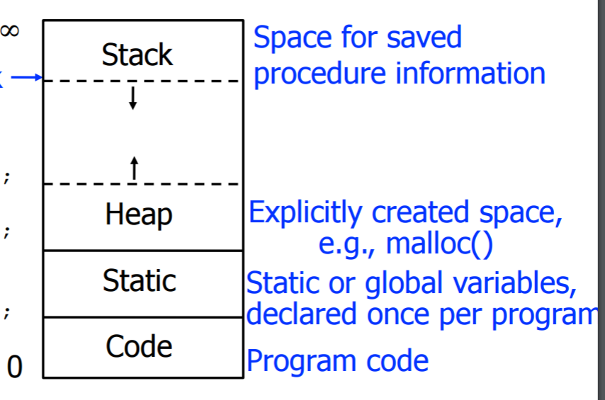
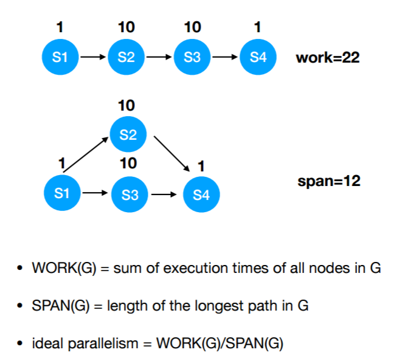
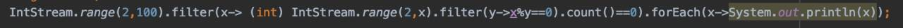

#### 考试范围

BNF
数据类型和运算符
程序控制结构
流计算
递归
并行计算
函数的调用和返回
Actor
异步执行

#### 三种编程语言

+   imperative language 命令式程序设计语言
    +   Variables, assignment statements, and iteration
    +   Include languages that support object-oriented programming, scripting languages, visual languages
    +   Ex.: C, Java, Perl, JavaScript, Visual BASIC .NET
+   Functional Language
    +   Computing by applying functions to given parameters
    +   Ex.: LISP, Scheme, ML
+   Logic Language (Highly inefficient)
    +   Rule-based (rules are specified in no particular order) 
    +   Ex.: Prolog

#### 历史

+   FORTRAN 1950s-1960s - 第一门高级语言
+   Pascal：第一门结构化语言
+   ALGOL 1960s: 
    +   Structured programming, free format lexical
    +   Top-down design and step-wise refinement
+   LISP: 1958 - beginning of **functional programming**
    +   Only two data types: atoms and lists
    +   Computations by applying functions to parameters
    +   No concept of variables (storage) or assignment
    +   Control via recursion and conditional expressions
+   BASIC: 1963 - beginning of **Timesharing language**
    +   BASIC: Beginner’s All-purpose Symbolic Instruction Code
    +   BASIC () " Kemeny & Kurtz at Dartmouth, 1963
    +   keyword: interactive
+   SIMULA: 1961- beginning of **Data Abstraction**
+   SmallTalk：1972 - beginning of **Object-Oriented Programming**
+   Language evaluation criteria
    +   Readability
    +   Writability
    +   Reliability
    +   Cost
+   The major methods of implementing programming languages are: compilation, pure interpretation, and hybrid implementation.

#### BNF（Backus-Naur Form）

+   Syntax: 语法	Semantics: 语义
+   BNF is a metalanguage--a language used to describe another language
+    BNF 概念
    +   lexeme 语素
    +   token 标记
+   BNF 结构
    +   Any word or words enclosed in angle brackets, < >, is a nonterminal -- it stands for some string (it’s like a string variable)
    +   The symbol ::= or -> means “is defined as”
    +   The symbol | means “or”
    +   Anything else is a terminal -- it stands for itself
+   缺点
    +   BNF isn’t great for setting limits on lengths
    +   BNF cannot do numeric comparisons
    +   BNF can only describe local syntax; it cannot refer to another part of the program
+   EBNF：引入正则表达式来简化BNF

#### Binding 绑定

+   **Imperative languages** are abstractions of **von Neumann architecture**.
    +   Variables $\leftrightarrow$ memory cells
    +   Expressions $\leftrightarrow$ CPU executions
    
+   Variable Attributes
    +   Name
    +   Value
    +   Type
    +   lifetime
    +   scope
+   Binding: an association **between a variable and its storage or its type**.
    +   A binding is **static** if it first occurs before run time and remains unchanged throughout program execution.
    +   A binding is **dynamic** if it first occurs during execution or can change during execution.
+   Variables:
    +   Static Variables
    +   Stack-dynamic Variables
    +   Explicit Heap-dynamic Variab: All objects in Java.
    +   **Implicit Heap-dynamic Variables**: Allocation and deallocation caused by assignment statements, regardless of what the variable was previously used for.
+   Scope
    +   **Static Scope**: Scope of a variable can be statically determined. 
        +   Variables can be hidden from a unit by having a "closer" variable with the same name.
    +   **Dynamic Scope**：
        +   Based on calling sequences of program units, not their textual layout.（在命名空间里找变量时并不是沿着 static chain跳的，而是一直往caller那儿跳）
        +   References to variables are connected to declarations by **searching back through the chain of subprogram** calls that forced execution to this point

#### Type 数据类型

+   Uses of Type
    +   Program organization and documentation
    +   Identify and prevent errors
    +   Support optimization
+   **primitive data types**: Those not defined in terms of other data types
+   String
    +   注意 C/C++ 里 String 是有上限的（maxsize = unsigned(-1)）
    +   Static length: compile-time descriptor
    +   Limited dynamic length: may need a run-time descriptor for length (but not in C and C++)
    +   Dynamic length: need run-time descriptor; allocation/deallocation is the biggest implementation problem.
+   Two common user-defined ordinal types
    +   **Enumeration**: All possible values, which are named constants, are provided or enumerated in the definition, e.g., C# example enum days {mon, tue, wed, thu, fri, sat, sun}; 
    +   **Subrange**: An ordered contiguous subsequence of an ordinal type, e.g., 12..18 is a subrange of integer type.
+   Array
    +   **Static**: subscript ranges are statically bound and storage allocation is static (before run-time)
    +   **Fixed stack-dynamic**: subscript ranges are statically bound, but the allocation is done at declaration time during execution
        +   C and C++ arrays without static modifier
    +   **Stack-dynamic**: subscript ranges and storage allocation are dynamically bound at elaboration time and remain fixed during variable lifetime.
    +   **Fixed heap-dynamic**: storage binding is dynamic but fixed after allocation, allocated from heap 
        +   C and C++ through malloc
    +   **Heap-dynamic**: binding of subscript ranges and storage is dynamic and can change
        +   C#: ArrayList
+   Union
    +   In Fortran, C, and C++, no language-supported type checking for union, called **free union**
        +   unsafe: Do not allow type checking.
    +   **Discriminated union**: supported by Ada.
+   Pointer and Reference 
    +   **pointer**: has a range of values that consists of memory addresses and a special value, nil.
        +   Operations: assignment and dereferencing
        +   Dangling pointers (dangerous)
            +   Tombstone
            +   Locks-and-keys
        +   Lost heap-dynamic variable $\rightarrow$ **memory leakage**
    +   **reference** : refers to an object or a value in memory, while a pointer refers to an address
        +   not sensible to do arithmetic on references
    +   Pointers or references are **necessary for dynamic data structures**.
+   Heap Management
    +   **Reference counters (eager)**
    +   **Garbage collection (lazy)**
        +   Disadvantages: when you need it most, it works worst.
+   Type Checking
    +   A programming language is **strongly typed** if type errors are always detected.
        +   FORTRAN 77 is not: EQUIVALENCE 
        +   **C and C++ are not**: unions are not type checked
    +   Type Equivalence
        +   Name Type Equivalence （类型的）名字要严格一样
        +   Structure Type Equivalence 只需要有同样的结构

#### 递归和尾递归

+   [LJY的整理](https://joeylian.github.io/ppl/2020/01/14/递归与尾递归/)

#### 并发

+   并发（concurrency）：⼀个程序的多个任务同时执行

+   并行（parallellism）：⼀个任务分解为多个字任务同时执行，协作完成⼀ 个问题

+   分布式：并行的计算在不同的计算机上进行

    

#### lambda表达式和流

+   [LJY的整理](https://joeylian.github.io/ppl/2020/01/14/Java-Lambda%E4%B8%8EStream%E7%AE%80%E8%AE%B0/)
+   **四类基本的函数式接口**：
    -   `Function：R apply(T t)；` 输入类型T返回类型R。
    -   `Consumer：void accept(T t)；` 输入类型T，消费掉，无返回。
    -   `Predicate：boolean test(T t)；` 输入类型T，并进行条件判断，返回true 或 false。
    -   `Supplier：T get()；` 无输入，产生一个T类型的返回值。
+   

#### Expression

+   Side Effects
    +   Functions in pure mathematics do not have side effects
    +   Solution 1: define the language by disallowing functional side effects
        +   No two-way parameters in functions
        +   No non-local references in functions
        +   Disadvantage: inflexibility of one-way parameters and lack of non-local references
    +   Solution 2: write the language definition to demand that operand evaluation order be fixed
        +   Java requires that operands appear to be evaluated in left-to-right order
+   Overloaded Operators
+   Short Circuit Evaluation
+   Type Conversions
    +   narrowing conversion
    +   widening conversion

#### Control

To be continued...

#### Subprograms

+   activation record (AR) 
    +   Format, or layout, of non-code part of an executing subprogram is called **activation record (AR) **.
    +   For a “simple” subprogram, AR has fixed size, and can be statically allocated (not in stack) .
    +    Allocate local variables on the run-time stack
        +   Main advantage: **support recursion**
        +   Use **Base pointer (BP)**: Always points at the base of the activation record instance of the currently executing program unit.
        +   When a subprogram is called, the current BP is saved in the new AR instance and the BP is set to point at the base of the new AR instance.
        +   Upon return from the subprogram, BP is restored from the AR instance of the callee.
    +   Local offset
        +   Local variables can be accessed by their offset from the beginning of the activation record, whose address is in the BP. This offset is called the local_offset
        +   The local offset of a local variable can be determined by the compiler at compile time.
+   static link
    +   Static link in an AR instance points to bottom of AR instance of the static parent 
+   dynamic link
    +   在子程序返回时恢复而保存的 base pointer 称为动态链指针
+   static chain
    +   （relative chain depth, local_offset）to find a variable.