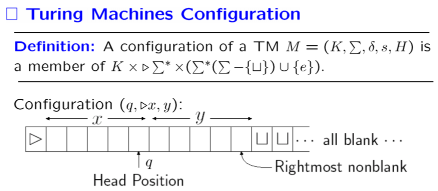
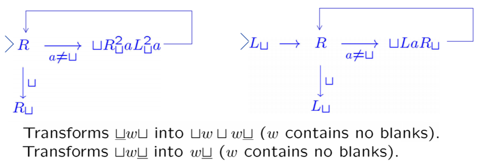
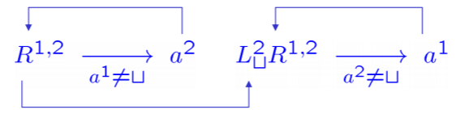
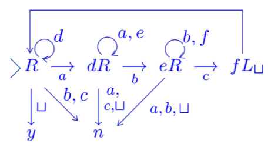
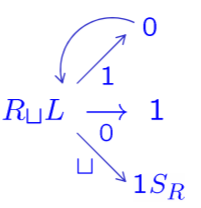

## Set and Language

+ The Diagonalization Principle
	- $R$ is the binary relation on set $A$.
	- $D$ is the diagonal set for $R$: $\{ a:a \in A \wedge (a,a) \notin R \}$.
	- Let $R_a = \{ b: b \in A \wedge (a,b) \in R \}$
	- Then **D is distinct from each $R_a$**.
+ if $\sigma$ is a finite alphabet, then $\sigma^\ast$ is countably infinite set (Lexicographically).
+ Kleene Star: $$\begin{aligned} L^{\ast} &=\{w \in \Sigma^{*}: w=w_{1} \cdots w_{k}, k \geq 0, w_{1}, \cdots, w_{k} \in L\} \\ &=L^{0} \cup L^{1} \cup L^{2} \cup \cdots \\ L^{+}&=L^{1} \cup L^{2} \cup L^{3} \cup \cdots \end{aligned}$$

## Regular Language $\leftrightarrow$ Finite Automata

+ Definition: The **Regular Expressions** are all strings over the alphabet $\sum \cup\{(,), \cup, \star\}$ that can be obtained as follows:
  1. $\Theta$ and $\{x\}(\forall x \in \Sigma)$ is a regular expression.
  2. If $\alpha$ and $\beta$ are regular expressions, then so are $(\alpha \beta)$ $(\alpha \cup \beta), \alpha^{\star}$.
  3. Nothing is regular expression unless it follows from 1 through 2.
+ The function $\mathscr{L}$ is defined as follows:
	1. $\mathscr{L}(\Theta)=\emptyset,$ and $\mathscr{L}(a)=\{a\}$ for each $a \in \Sigma$
    2. If $\alpha$ and $\beta$ are regular expressions, then 
		+ ${\mathscr{L}(\alpha \beta)=\mathscr{L}(\alpha) \mathscr{L}(\beta)}$
		+ ${\mathscr{L}(\alpha \cup \beta)=\mathscr{L}(\alpha) \cup \mathscr{L}(\beta)}$ 
		+ ${\mathscr{L}(\alpha^{\star})=\mathscr{L}(\alpha)^{*}}$
	> Example: $\mathscr{L}(((a \cup b)^{\star} a))=(\{a, b\})^{\ast}\{a\}$
+ Definition: The class of regular languages over an alphabet $\Sigma$ is defined to consist of all languages $L$ such that $L=L(a)$ for some regular expression a over $\Sigma .$ i.e. the class of regular languages over an alphabet $\Sigma$ is precisely the closure of the set of languages: $\{\{\sigma\}: \sigma \in \Sigma\} \cup\{\emptyset\}$.
+ Definition: A **Deterministic Finite Automata** is a quintuple $(K, \Sigma, \delta, s, F),$ where
	- $K$ is a finite set of states
	- $\Sigma$ is an alphabet
	- $s \in K$ is the initial state
	- $F \subseteq K$ is the set of final states
	- $\delta:$ transition **function** $K \times \sum \rightarrow K$
+ Definition: A **Nondeterministic Finite Automata** is a quintuple $(K, \Sigma, \Delta, s, F),$ where
	- $K$ is a finite set of states
	- $\Sigma$ is an alphabet
	- $s \in K$ is the initial state $-F \subseteq K$ is the set of final states.
	- $\Delta,$ transition relation, is a subset of $K \times(\sum \cup\{e\}) \times K$
+ Theorem: **For each NFA, there is an equivalent DFA**.
	+ Key idea: Every subset of $K$ becomes a single state in the new machine.
    + Construction: For any NFA $M=(K, \Sigma, \Delta, s, F)$, construct an equivalent DFA $M^{\prime}=(K^{\prime}, \Sigma, \delta, s^{\prime}, F^{\prime})$:
    	- $K^{\prime}=2^{K}$
    	- $s^{\prime}=E(s)$
    	- $F^{\prime}=\{Q | Q \subseteq K, Q \cap F \neq \emptyset\}$
    	- For each $Q \subseteq K$ and $\forall a \in \Sigma$, let $\delta(Q, a)=\cup\{E(p) | p \in K$ and $(q, a, p) \in \Delta$ for some $q \in Q\}$
    + Claim: For any string $w \in \sum^{\ast}$ and any states $p, q \in K$, $(q, w) \vdash_{M}^{\ast}(p, e) \Leftrightarrow(E(q), w) \vdash_{M^{\prime}}^{\ast}(P, e)$ (for some set $P$ containing $p$).
		> Use Mathematical Induction to prove this claim.
+ **Closure Properties** of Regular Languages: The class of languages accepted by FA is **closed** under:
    - Union
        + use NFA to simply prove it.
        + Note: Any finite union of regular sets is regular. **Infinite unions may not** be regular.
    - Concatenation
    - Kleene star
    - Complementation
        + Simply reverse the Final State.
    - Intersection
        - Prove1: $L (M_{1}) \cap L(M_{2})=\sum^{\ast}-(\sum^{\ast}-L(M_{1})) \cup(\sum^{\ast}-L(M_{2}))$
        - Prove2: $K = K_1 \times K_2, F = F_1 \times F_2\dots$
    - **Example**: Show $L=\{w \in\{a, b\}^{\ast}: w \text { has an equal number of } a^{\prime} s \text { and } b^{\prime} s\}$ is not regular.
    - **Proof**: If $L$ is regular, then so would be $L \cap a^{\ast} b^{\ast}$ But $L \cap a^{\ast} b^{\ast}=\{a^{n} b^{n}: n \geq 0\}$ is not regular language.
+ Theorem: **A language is regular iff it is accepted by a $\mathrm{FA}$ .**
	- $\mathrm{RL}\rightarrow \mathrm{FA}$: Simply use the above properties.
	- $\mathrm{FA}\rightarrow \mathrm{RL}$ 
		+ Definition: For $i, j=1, \cdots, n$ and $k=0, \cdots, n$, define $R(i, j, k)=\{w | w \in \sum^{\ast}, \delta(q_i, w)=q_j \}$ and for any prefix $x$ of $w$, $x \neq e$, $\delta (q_{i}, x)=q_{l} \wedge (l \leq k)$. 
		+ i.e. Each string $w$ which satisfies that $q_i$ use $w$ to reach $q_j$ just with the help of $q_1\dots q_k$.
		+ Lemma: $R(i, j, k)$ are regular languages.
		+ Construct the new equivalent FA $K'=K \cup \{s',f'\}$ that has the only initial state and the only final state. $R(s',f',n)$ is the regular language we construct.
+ Theorem: (**Pumping Theorem**) Let $L$ be a regular language. Exist an integer $n \geq 1$ such that **any** string $w \in L$ with $|w| \geq n$ can be written as $w=x y z$ such that:
	- $y \neq e$
	- $|xy| \leq n$
	- for each $i \geq 0, xy^{i}z \in L$
	**Example**: Show $L=\{a^{n} | n \text { is prime }\}$ is not regular.
	**Proof**: 
		+ Assume $L$ regular. $\exists w=x y z,$ and $x=a^{p}, y=a^{q}$ and $z=a^{r},$ where $p, r \geq 0$ and $q>0$ (**any $p,q,r$ as long meets the condition**). 
		+ By Pumping theorem, $x y^{n} z \in L$ for each $n \geq 0 ;$ that is, $p+n q+r$ is prime for each $n \geq 0$.
		+ However, let $n=p+2 q+r+2 ;$ then $p+n q+r=(q+1) \cdot(p+2 q+r)$

## Context-Free Language $\leftrightarrow$ PushDown Automata
+ Definition: A **Context-Free Grammar** is a quadruple $G=(V, \Sigma, R, S),$ where
	- $V$ is an alphabet;
	- $\Sigma \subseteq V$ is the set of terminal symbols; 
	- $S \in V-\sum$ is the start symbol;
	- $R$ is the set of rules, a finite subset of $(V-\Sigma) \times V^{*}$
	**Example**: Let $G=(\{S, a, b\},\{a, b\}, R=\{S \rightarrow e, S \rightarrow S S, S \rightarrow a S b, S \rightarrow b S a\}, S)$, then $L(G)=\{w \in\{a, b\}^{\ast}: w \text { has the same number of } a^{\prime} s \text { and } b^{\prime} s\}$
+ Definition: A **PushDown Automata** is a sextuple $M=\left(K, \sum, \Gamma, \Delta, s, F\right)$, where
	- $K$ is a finite set of states
	- $\sum$ is an alphabet (the input symbols)
	- $\Gamma$ is an alphabet (the stack symbols)
	- $s \in K$ is the initial state
	- $F \subseteq K$ is the set of final states
	- $\Delta,$ transition relation, is a subset of $(K \times(\sum \cup\{e\}) \times \Gamma^{\ast}) \times(K \times \Gamma^{\ast})$.
+ $\mathrm{PDA}$ **execution**: reading a symbol
Consider $((p, \alpha, \beta),(q, \gamma)) \in \Delta,$ Then the PDA can: 
	- enter some state $q$
	- replace $\beta$ by $\gamma$ on the top of the stack
  - advance the tape head
  **Note**:
		1. If $\beta=abc$, then $a$ is the top and $c$ is the bottom. 
		2. PDA receives strings when reach the final state and its stack is empty.
+ Theorem: **The class of languages accepted by PDA is exactly the class of CFL**.
    - $\mathrm{CFL} \rightarrow \mathrm{PDA}$
		+ Build $2-$state PDA and simply change each grammar to each transition relation.
	- $\mathrm{PDA} \rightarrow \mathrm{CFL}$
		+ Definition: A PDA is simple if the following is true: Whenever $((q, a, \beta),(p, \gamma))$ is a transition of the PDA and $q$ is not the start state, then $\beta \in \Gamma$ and $|\gamma| \leq 2$.
		+ $\mathrm{PDA} \rightarrow \mathrm{simple~PDA} \rightarrow \mathrm{CFL}$
+ **Closure Properties**: The CFL are closed under Union, Concatenation, and Kleene star.
+ **Theorem**: The Intersection of a CFL with a regular language is a CFL.
+ **Pumping Theorem** for CFL.
	- Lemma: The yield of any parse tree of G of height $h$ has length at most $\phi(G)^{h}$.
	- Theorem: Let $G=(V, \Sigma, R, S)$ be a CFG. Then any string $w \in L(G)$ of length greater than $\phi(G)|V-\Sigma|$ can be rewritten as $w=u v x y z$ in such way that
		+ $|v y| \geq 1$
		+ ${u v^{n} x y^{n} z \in L(G) \text { for every } n \geq 0}$
	- **Example**: Show that $L=\{a^{n} b^{n} c^{n}: n \geq 0\}$ is not CFL.
	- **Proof**: 
		+ **Case** $1$: $v, y$ contains occurrences of all three symbols $a, b, c$ $\Rightarrow$ at least one of $v, y$ must contain at least two of them $\Rightarrow$ order error in $u v^{2} x y^{2} z$.
		+ **Case** $2$: $v, y$ contains occurrences of some but not all of them $\Rightarrow u v^{2} x y^{2} z$ has unequal number of $a^{\prime} s, b^{\prime} s$ and $c^{\prime} s$

## Turing Machine
+ Definition: A **Turing Machine** is a quintuple $(K, \sum, \delta, s, H)$ where
	- $K$ is a finite set of states
	- $\Sigma$ is an alphabet containing $\cup (\text {blank symbol})$ and $\rhd(\text {left end})$ but not containing the symbols $\leftarrow$ and $\rightarrow$ 
	- $s \in K$ is the initial state 
	- $H \subseteq K$ is the set of halting states 
	- $\delta:(K-H) \times \sum \rightarrow K \times (\sum \cup\{\leftarrow, \rightarrow\})$ be the transition *function*:
		+ $\forall q \in K-H$ if $\delta(q, \rhd)=(p, b),$ then $b=\rightarrow$
		+ $\forall q \in K-H$ and $a \in \sum,$ if $\delta(q, a)=(p, b),$ then $b \neq \rhd$

+ Notation for Turing Machine
	- $M_a$ (or simply `a`): The machine with two states that only to write $a$ on the tape.
	- $M_\leftarrow$ and $M_\rightarrow$ (or simply `L` and `R`): The machine with two states that only move left or right.
	- Machine Combination: $M_1 \stackrel{a}{\longrightarrow} M_2$. If the scanned symbol when halting is $a$, $M_2$ starts up.
	
+ **Example**：
    

+ **Multiple tapes Turing Machine**
	- Definition: Let $k \geq 1$ be an integer. A $k$ -tape TM is a quintuple $(K, \sum, \delta, s, H)$. The transition function $ \delta:(K-H) \times \sum^{k} \rightarrow K \times(\sum \cup\{\leftarrow, \rightarrow\})^{k}$.
	- Conventionally, the input string is placed on the first tape, as well as the output string.
	- Example：2-tapes copy machine：
		
	- Theorem: Any $k-$ tapes TM $M$ has a corresponding standard machine $M \prime$ so that:
		+ $\forall x \in \sigma \ast$, they halt in the same state and output same string.
		+ If $M$ halts on input $x$ after $t$ steps, then $M^{\prime}$ halts on input $x$ after a number of steps which is $\mathscr{O}(t \cdot(|x|+t))$

## More concepts

+ **Recursive**
	- $M$ decides $L \subseteq \Sigma^{\ast}$ if $\forall w \in \Sigma^{\ast}$ the following is true:
		+ $w \in L$ iff $M$ accepts $w$ (ends in the $yes$ configuration)
		+ $w \notin L$ iff $M$ rejects $w$ (ends in the $no$ configuration)
	- A language $L$ is **recursive** if $\exists$ a $\mathrm{TM}$ that decides $L$.
	- Example:  $L=\{a^{n} b^{n} c^{n}: n \geq 0\} .$ The Turing Machine shown below decides $L$.
		
	- Definition: Let $f$ be a function $f: \Sigma_{0}^{\ast} \rightarrow \Sigma_{0}^{\ast}$ . $M$ **computes** function $f$ if $\forall w \in \Sigma_{0}^{\ast}, M(w)=f(w)$. 
	    + A function $f$ is **recursive** if $\exists$ a TM $M$ **computes** $f$.
	    + Example: $succ(n)=n+1$. 
	    	
	- Properties:
		+ The recursive language is  are closed under Union, Intersection, and Complement.
		+ .The recursive language is recursive enumerable.
+ **Recursive Enumerable**
	- Definition: Let $M=(K, \Sigma, \delta, s, H)$ is a TM. Let $\Sigma_{0} \subseteq$ $\Sigma-\{\rhd, \sqcup\}$ be an alphabet and $L \subseteq \Sigma_{0}^{*}$
		+ $M$ **semidecides** $L$ if for $\forall w \in \Sigma^{*}$ the following is true: $w \in L \Leftrightarrow M$ halts on input $w$.
		+ A language $L$ is **recursively enumerable**(r.e.), iff $\exists a$ TM $M$ that **semidecides** $L$
		+ $M \uparrow$ means $M$ can not halt.

+ **grammar**
    + Definition: A **grammar** (or unrestricted grammar) is a quadruple $G=(V, \Sigma, R, S),$ where
        - $V$ is an alphabet;
        - $\Sigma \subseteq V$ is the set of terminal symbols ($V-\sum$ is called the set of nonterminal symbols).
        - $S \in V-\sum$ is the start symbol
        - $R$ is the set of rules, a finite subset of $(V^{\ast}(V-\Sigma) V^{\ast}) \times V^{\ast}$
	+ Theorem: A language is generated by a **grammar** if and only if it is **recursively enumerable**.
	+ Definition: Let $G=(V, \Sigma, R, S)$ be a *grammar*, and let $f: \Sigma^{\ast} \rightarrow \Sigma^{\ast}$ be a function. $G$ **computes** $f$, if for all $w, v \in \Sigma^{\ast},$ the following is true: $S w S \Rightarrow_{G}^{\ast} v \text { iff } v=f(w)$
	+ A function $f: \Sigma^{\ast} \rightarrow \Sigma^{\ast}$ is called **grammatically computable** iff there is a *grammar* $G$ that **computes** it.
	+ Theorem: A function $f: \Sigma^{\ast} \rightarrow \Sigma^{\ast}$ is **recursive** iff and only if it is **grammatically computable**.

+ **primitive recursive function**
	- The **primitive recursive functions** are all basic functions (*the $k$-ary zero function, the $j$-th $k$-ary identity function,  the successor function*), and all functions that can be obtained by them by any number of successive applications of composition and recursive definition.
	- Example
		+ $\mathrm{plus(m, 0)=m, plus(m, n+1)=succ(plus(m, n))}$
		+ $\mathrm{mult(m, 0)=zero(m),mult(m, n+1)=plus(m, mult(m, n))}$
		+ $\mathrm{exp (m, 0)=succ(zero(m)),exp(m, n+1)=mult(m, exp (m, n))}$
		+ $n \sim m = \max(n-m,0)$
	- Definition: A **primitive recursive predicate** is a primitive recursive function that only takes values 0 and $1$. 
	    - $f(\pmb{x})=g(\pmb{x}) \text{ if } c(x) \text{ otherwise } h(\pmb{x})$. $f(\pmb{x})$ is also primitive recursive if others are.
	    - If $p\left(n_{1}, \ldots, n_{k}, m\right)$ is primitive recursive predicate, then $\exists t_{(\leq m)} p\left(n_{1}, \ldots, n_{k}, t\right) \text { and } \forall t_{(\leq m)} p\left(n_{1}, \ldots, n_{k}, t\right)$ are primitive recursive predicates.
	- Example: 
		+ $\mathrm{rem, div}$
		+ $\operatorname{digit}(m, n, p)=\operatorname{div}(\operatorname{rem}(n, p \uparrow m), p \uparrow(m \sim 1))$
		+ $y | x \Leftrightarrow \exists t_{(\leq x)}(y \cdot t=x)$
		+ $\mathrm{prime}(x) \Leftrightarrow(x>1) \wedge \forall t_{(<x)}[t=1 \vee \neg(t | x)]$
	- Note: The set of primitive recursive function is **proper subset** of the set of recursive function.
		+ Prove: List all the primitive recursive function $f_i$. Assume $g(n)=f_n(n)+1$, so $g$ is computable but not primitive recursive.
	- Definition: A function is **$\mu$-recursive** if it can be obtained from the basic functions by the operations of composition, recursive definition, and minimalization of minimalizable functions.
		+ $\log (m, n)=\mu ~ p[\text {greater-than-or-equal( }(m+2) \uparrow p, n+1)]$
	- Theorem: A function $f: \mathbb{N}^{k} \rightarrow \mathbb{N}$ is **$\mu$ -recursive** iff it is recursive (that is, computable by a TM).

## Undecidability

+   Church - Turing thesis: Intuitive notation of "computable" = Formal notation of "computable functions by TM" .
    +   A problem is **decidable** iff it is **recursive**.
+   There is no program, no algorithm for solving the halting problem.
+   Theorem: Let $H=\{''M''~''w'': \text { TM } M \text { halts on input string } w \}$ The language $H$ is not recursive (but r.e.).
    +   Therefore, the class of recursive languages is a strict subset of the class of recursively enumerable languages.
    +   Proof:
    	- $H$ recursive $\Rightarrow H_{1}$ recursive, where $H_{1}=\{''M^{\prime \prime}: M \text { halts on input "M" }\}$
        $M$ Who decides $H$ surely decides $H_1$.
        - $H_{1}$ recursive $\Rightarrow \overline{H_{1}}$ recursive.
        The class of recursive languages is closed under complement.
        - $\overline{H_{1}}$ is not even a r.e. language.
    - Note that $H_1$ is r.e.
- Properties of Recursive Languages
	+ $L$ is recursive iff $L$ and $\hat{L}$ are both r.e..
	    + Left $\rightarrow$ Right: Simple.
	    + Right $\rightarrow$ Left: Left two $TM$ run simultaneously, either of them will stop finally.
+   Definition: We say that a Turing machine $M$ enumerates the language $L$ iff for some fixed state $q$ of $M$, $L=\{w:(s, \rhd, \underline \sqcup) \vdash_{M}(q, \rhd, \underline  \sqcup w)\}$. A language is Turing-enumerable iff there is a Turing machine that enumerates it.
	- A language is **recursively enumerable** iff it is Turing-enumerable.
	- A language is **recursively** iff it is lexicographically Turing-enumerable.
- **Rice Theorem:** If $S$ is a class of recursively enumerable languages such that $\mathscr{I}(S)$ is neither empty nor the set of all indices, then $\mathscr{I}(S)$ is undecidable.

