## Singular Value decomposition(SVD)
- a factorization of a normal matrix, extended from eigendecomposition.
- $A_{n \times m} = U_{n \times n}\Sigma_{n \times m}V^T_{m \times m}$
    + $(A^TA)v_i = \lambda_iv_i$
    + **singular values**: $\sigma_i = \sqrt{\lambda_i}$
    + $u_i=\frac{1}{\sigma_i}Av_i$
- One can easily verify that the square matrix also satisfies this definition(the same as eigendecomposition).
- $U,V$ are orthogonal matrices
- Usually we set $r \in (0,rk(A)]$ to approximate SVD.
    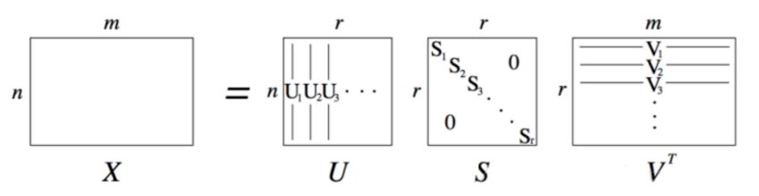

## Transfomation in 2D

|Name|Function|Preserve|DOF|
|----|--------|--------|---|
|Isometries|rotation, translation|distance|$3$|
|Similarities|[above], scale|ratio of lengths, angles|$4$|
|Affinities||parallel lines, ratio of areas and lengths|$6$|
|Projective||cross ratio of 4 collinear points, collinearity|$8$|

- **Rotation+Scaling+Translation**  
    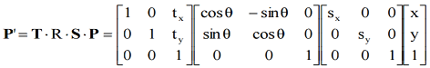

- **Affinities**  
    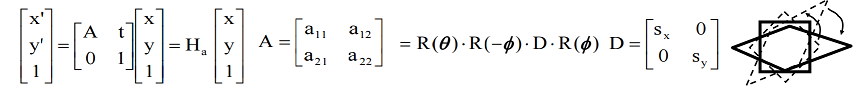

- **Projective** 
    

- **Cross in Matrix**  
    

## Projective  
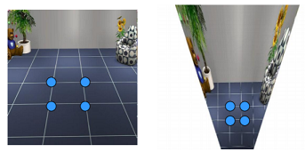

- $x=PX,x'=P'X$ How to change $x$ to $x'$?
- In 2D perspective, $x'=Hx$. However, due to projective transformation, they are in 3D Homogeneous Coordinates and $x' \times Hx = 0$, where $\times $ means cross product.
- Rewrite $9$ parameters from $H$ in a column vector $h$. For one pair of points, it can be derived that $A_{3\times9}h_{9 \times 1}=0$. Note that although there are $3$ equations, only $2$ of them are independent. So finally we can acquire that $A_{2N\times9}\cdot h=0$
- Use SVD to solve this equation: $A=U_{2N\times9}\Sigma_{9\times9}V^T_{9\times9}$. **$h$ is is the last column of $V^T$.**

## Camera Model

+ **Pinhole camera**  
    - Because the point is not exactly at the center, we should add shift parameters $c_x$ and $c_y$. So that $x'=f_xx+c_x, y'=f_yy+c_y$.  
        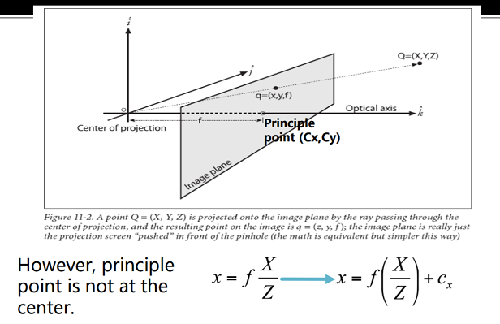
	- Why the aperture cannot be too small?
		+ Less light passes through
		+ Diffraction effect

+ Lenses
	- For thin lense:  
		

## Camera Calibration
- **intrinsic parameters**
    + From Pinhole Camera Model, totally $4$ parameters. Use the trick of **Homogeneous Coordinates**, finally:  
        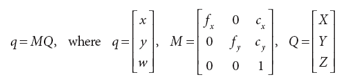
- **extrinsic parameters**
    + rotation and translation
    + $6$ parameters: $(\theta, \phi, \psi, c_x, c_y, c_z)$
- **distortion parameters**
    + Radial distortion  
          
        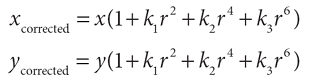
    + Tangential distortion  
        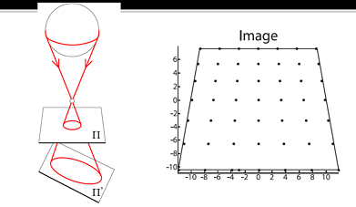  
        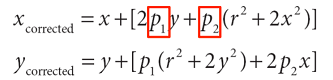
    + $5$ parameters: $(k1,k2,k3,p1,p2)$
- **Camera Calibration**
    + Without distortion, the transform matrices are as follows ($s$ is the Skew parameter):  
        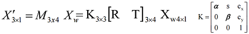
    + parameters number: $5+3+3=11$. Need $6$ correspondences.
- **Homogeneous $M \times N$ Linear Systems**
	+ $Ax=0$, $A_{M \times N}, M > N$
	+ To find non-zero solution, Minimize $|Ax|^2$ under the constraint $|x|^2=1$.
	+ A possible method: Direct Linear Transformation
	+ General method for Calibration Problem: Compute SVD decomposition of $A$, the last column of V gives $x$.
	+ Degenerate cases
		- Points cannot lie on the same plane.
		- Points cannot lie on the intersection curve of two quadric surfaces.

- **Taking Radial Distortion into Account**
	+ nonlinear
	+ Methods
        - Newton Method
        - Levenberg-Marquardt Algorithm
    + The latter doesn’t require the computation of $H$.

## Stereo-view Geometry

- Sets of parallel lines on the same plane lead to collinear **vanishing points**.
- **Epipolar Geometry 对极几何**  
	

- **Epipolar Constraint**  
	
    + Denote $p=K[I,0]P$ and $p'=K[R,T]P$.
    + Let $x=K^{-1}p$, finally we get that $x^T \cdot [T \times (Rx')] = 0$, which is called ***Epipolar Constraint***. It means that **vector $x^T$,$T$ and $Rx'$ are coplanar**.
    + Denote $E=T \times R$, then $x^TEx'=0$, $E$ is called ***Essential Matrix***.
	+ Properties about Essential Matrix  
		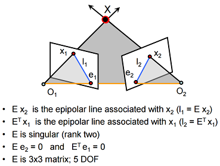
	+ Write back $K$(may different between cameras), $F$ is called ***Fundamental Matrix***.
		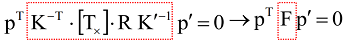
    + Properties about Fundamental Matrix is similar to essential matrix. $7$ DOF.

- **Solve for Fundamental Matrix**
	+ $Wf = 0$ ($f_{9 \times 1}$ collects the parameters in $F$).
		- If $rk(W)=8$:  exists unqiue $f$.
		- If $rk(W)>8$:  find $\hat F$calculated by SVD.
	+ Note that $F$'s rank is $2$ but $\hat F$ may not. Second equation: $||F-\hat F|| =0$ and $det(F)=0$
	+ Normalization
		- Transform one image first before calculating $F$.
		- Find a transform that: Origin (1) centroid of image points. (2) Mean square distance of the data points from origin is $2$ pixels.

## Stereo systems

+ Some applications
    - Stereo vision: Estimate the position of $P$ given the observation of $P$ from two view points.
    - Triangulation: Intersecting the two lines of sight gives rise to $P$

+ Making image planes parallel
    - Goal: Estimate the perspective transformation $H$ that makes the images parallel.
    - To be continued...

+ Correspondence problem
    - Correlation Methods  
        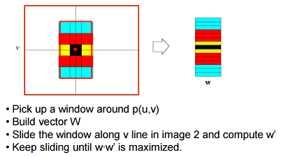
    - Smaller window
        + More detail
        + More noise
    - Larger window
        + Smoother disparity maps
        + Less prone to noise
    - To be continued...

## Image Processing

- Filters
    + goals
        - Extract useful information from the images
        - Modify or enhance image properties
    + Gaussian Filters  
        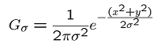
        - Rule of thumb: set filter half-width to about $3\sigma$
        - *Separable* kernel; Convolution with self is another Gaussian
    + Median and Mean filter

- Differentiation  
    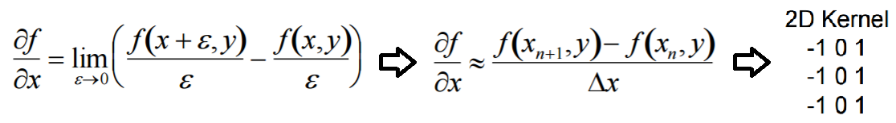

- Sub-sampling
    + Problem: Aliasing
    + Sampling Theorem (Nyquist)： When sampling a signal at discrete intervals, the sampling frequency must be $2f_{max}$($f$ is frequency).

- Edge Detection
    + Edge: a location with high gradient
    + Most widely used method: Canny Edge Detection
        1. Gaussian smoothing
        2. & Derivative = Derivative of Gaussian
        3. Find magnitude and orientation of gradient
        4. Extract edge points: "Non-maximum suppression"
        5. Linking and thresholding "Hysteresis"

- Corner Detector  
    
    + Harris Detector
        - To be continued...