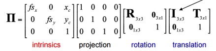

## Singular Value decomposition(SVD)
- a factorization of a normal matrix, extended from eigendecomposition.
- $A_{n \times m} = U_{n \times n}\Sigma_{n \times m}V^T_{m \times m}$
    + $(A^TA)v_i = \lambda_iv_i$
    + **singular values**: $\sigma_i = \sqrt{\lambda_i}$
    + $u_i=\frac{1}{\sigma_i}Av_i$
- One can easily verify that the square matrix also satisfies this definition(the same as eigendecomposition).
- $U,V$ are orthogonal matrices
- Usually we set $r \in (0,rk(A)]$ to approximate SVD.
    

## Transfomation in 2D
- Rotation+Scaling+Translation

    
- Affinities

    

## Camera Calibration
- intrinsic parameters
    + Simply use similar triangle to find the fomula:

        
    + Because the point is not exactly at the center, we should add shift parameters $c_x$ and $c_y$, totally $4$ parameters.
    + Use the trick of **Homogeneous Coordinates**, finally:

        
- extrinsic parameters
    + rotattion and translation
    + $6$ parameters: $(\theta, \phi, \psi, c_x, c_y, c_z)$
- distortion parameters
    + Radial distortion

        

        
    + Tangential distortion

        

        
    + $5$ parameters: $(k1,k2,k3,p1,p2)$
- Camera Calibration
    + To find above parameters

        
